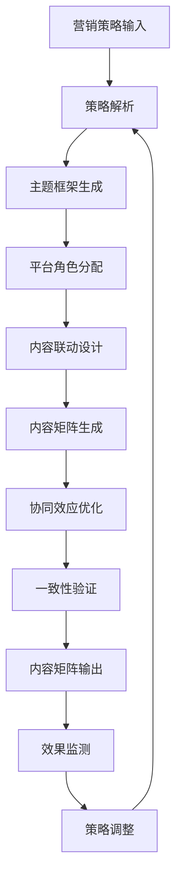

# AIMS 内容编排引擎设计

## 🎯 内容编排引擎核心理念

### 从单点生成到系统编排

**传统内容生成**：
```
输入：单个内容需求
处理：独立生成内容
输出：单条内容
```

**AIMS内容编排**：
```
输入：营销策略 + 传播目标
处理：系统性内容规划 + 协同生成
输出：完整内容矩阵 + 联动机制
```

### 篮球战术与内容编排的对应关系

| 篮球战术元素 | 内容编排对应 | 技术实现 |
|------------|------------|---------|
| 战术板设计 | 内容策略规划 | 策略解析引擎 |
| 球员定位 | 平台角色分配 | 平台角色引擎 |
| 传球路线 | 内容引导路径 | 跨平台联动引擎 |
| 进攻节奏 | 发布时序控制 | 时间编排引擎 |
| 战术配合 | 内容协同效应 | 协同效应引擎 |
| 临场调整 | 策略动态优化 | 反馈优化引擎 |

## 🏗️ 内容编排引擎架构

### 1. 核心组件设计

```typescript
interface ContentOrchestrationEngine {
  // 策略解析器
  strategyParser: StrategyParser;
  
  // 主题框架生成器
  themeGenerator: ThemeFrameworkGenerator;
  
  // 平台角色分配器
  roleAssigner: PlatformRoleAssigner;
  
  // 内容联动设计器
  connectionDesigner: ContentConnectionDesigner;
  
  // 内容矩阵生成器
  matrixGenerator: ContentMatrixGenerator;
  
  // 协同效应评估器
  synergyEvaluator: SynergyEvaluator;
}
```

### 2. 策略解析引擎

```typescript
class StrategyParser {
  // 解析营销策略
  parseStrategy(strategy: MarketingStrategy): ParsedStrategy {
    return {
      objective: this.extractObjective(strategy),
      targetAudience: this.analyzeAudience(strategy),
      keyMessages: this.extractKeyMessages(strategy),
      platforms: this.identifyPlatforms(strategy),
      timeline: this.parseTimeline(strategy),
      constraints: this.identifyConstraints(strategy)
    };
  }
  
  // 提取营销目标
  private extractObjective(strategy: MarketingStrategy): MarketingObjective {
    // 基于策略描述和目标关键词识别主要目标
    const objectiveKeywords = {
      'brand_awareness': ['认知', '知名度', '曝光', '品牌'],
      'product_launch': ['发布', '上线', '推出', '新品'],
      'lead_generation': ['线索', '获客', '注册', '咨询'],
      'sales_conversion': ['销售', '转化', '购买', '成交'],
      'customer_retention': ['留存', '复购', '忠诚', '维系']
    };
    
    return this.matchObjective(strategy.description, objectiveKeywords);
  }
  
  // 分析目标受众
  private analyzeAudience(strategy: MarketingStrategy): AudienceProfile {
    return {
      demographics: this.extractDemographics(strategy),
      psychographics: this.extractPsychographics(strategy),
      behaviors: this.extractBehaviors(strategy),
      platforms: this.mapAudienceToPlatforms(strategy)
    };
  }
  
  // 提取核心信息
  private extractKeyMessages(strategy: MarketingStrategy): KeyMessage[] {
    // 使用NLP技术提取核心信息点
    const messages = this.nlpExtractor.extractKeyPoints(strategy.description);
    
    return messages.map(msg => ({
      primary: msg.main,
      supporting: msg.details,
      evidence: msg.proof,
      emotion: msg.emotionalTone
    }));
  }
}
```

### 3. 主题框架生成器

```typescript
class ThemeFrameworkGenerator {
  // 生成主题框架
  async generateFramework(parsedStrategy: ParsedStrategy): Promise<ThemeFramework> {
    // 1. 创建叙事弧线
    const narrativeArc = await this.createNarrativeArc(parsedStrategy);
    
    // 2. 确定情感基调
    const emotionalTone = this.determineEmotionalTone(parsedStrategy);
    
    // 3. 提取内容支柱
    const contentPillars = this.extractContentPillars(parsedStrategy);
    
    // 4. 设计主题变奏
    const themeVariations = this.designThemeVariations(parsedStrategy);
    
    return {
      coreNarrative: narrativeArc,
      emotionalTone,
      contentPillars,
      themeVariations,
      consistencyRules: this.defineConsistencyRules(parsedStrategy)
    };
  }
  
  // 创建叙事弧线
  private async createNarrativeArc(strategy: ParsedStrategy): Promise<NarrativeArc> {
    const arcTypes = {
      'product_launch': {
        setup: '问题/需求识别',
        conflict: '现有解决方案不足',
        resolution: '新产品解决方案',
        conclusion: '美好未来愿景'
      },
      'brand_awareness': {
        setup: '行业现状介绍',
        conflict: '用户痛点展现',
        resolution: '品牌价值主张',
        conclusion: '品牌承诺兑现'
      }
    };
    
    const selectedArc = arcTypes[strategy.objective] || arcTypes['brand_awareness'];
    
    return {
      phases: Object.entries(selectedArc).map(([phase, description]) => ({
        name: phase,
        description,
        keyMessages: this.mapMessagesToPhase(strategy.keyMessages, phase),
        emotionalCurve: this.calculateEmotionalCurve(phase)
      }))
    };
  }
  
  // 提取内容支柱
  private extractContentPillars(strategy: ParsedStrategy): ContentPillar[] {
    // 基于营销目标和关键信息提取内容支柱
    const pillarTemplates = {
      'product_launch': [
        { name: '产品价值', weight: 0.4 },
        { name: '用户场景', weight: 0.3 },
        { name: '技术优势', weight: 0.2 },
        { name: '社会证明', weight: 0.1 }
      ],
      'brand_awareness': [
        { name: '品牌故事', weight: 0.3 },
        { name: '价值主张', weight: 0.3 },
        { name: '行业洞察', weight: 0.2 },
        { name: '用户共鸣', weight: 0.2 }
      ]
    };
    
    const templates = pillarTemplates[strategy.objective] || pillarTemplates['brand_awareness'];
    
    return templates.map(template => ({
      ...template,
      messages: this.mapMessagesToPillar(strategy.keyMessages, template.name),
      platforms: this.assignPillarToPlatforms(template.name, strategy.platforms)
    }));
  }
}
```

### 4. 平台角色分配器

```typescript
class PlatformRoleAssigner {
  // 分配平台角色
  assignRoles(strategy: ParsedStrategy, theme: ThemeFramework): PlatformRoleMap {
    const roleMap = new Map<string, PlatformRole>();
    
    // 基于平台特性和策略目标分配角色
    strategy.platforms.forEach(platform => {
      const role = this.determinePlatformRole(platform, strategy, theme);
      roleMap.set(platform, role);
    });
    
    // 确保角色分配的协调性
    this.validateRoleCoordination(roleMap, strategy);
    
    return roleMap;
  }
  
  // 确定平台角色
  private determinePlatformRole(
    platform: string, 
    strategy: ParsedStrategy, 
    theme: ThemeFramework
  ): PlatformRole {
    // 平台特性矩阵
    const platformCharacteristics = {
      'weibo': {
        strengths: ['快速传播', '话题引导', '实时互动'],
        audience: ['年轻用户', '都市白领', '意见领袖'],
        contentTypes: ['短文本', '图片', '视频', '话题']
      },
      'zhihu': {
        strengths: ['专业权威', '深度内容', '理性讨论'],
        audience: ['专业人士', '知识工作者', '决策者'],
        contentTypes: ['长文章', '问答', '专栏', '想法']
      },
      'xiaohongshu': {
        strengths: ['场景展示', '生活方式', '用户种草'],
        audience: ['年轻女性', '消费者', '生活达人'],
        contentTypes: ['图文笔记', '视频', '直播', '购物']
      },
      'douyin': {
        strengths: ['视觉冲击', '娱乐性强', '病毒传播'],
        audience: ['全年龄段', '娱乐用户', '创作者'],
        contentTypes: ['短视频', '直播', '挑战赛', '音乐']
      }
    };
    
    const characteristics = platformCharacteristics[platform];
    
    // 基于策略目标匹配最佳角色
    const roleMapping = {
      'brand_awareness': this.mapAwarenessRole(characteristics, theme),
      'product_launch': this.mapLaunchRole(characteristics, theme),
      'lead_generation': this.mapLeadGenRole(characteristics, theme),
      'sales_conversion': this.mapConversionRole(characteristics, theme)
    };
    
    return roleMapping[strategy.objective] || 'SUPPORT_CHANNEL';
  }
  
  // 品牌认知角色映射
  private mapAwarenessRole(characteristics: any, theme: ThemeFramework): PlatformRole {
    if (characteristics.strengths.includes('快速传播')) {
      return 'AWARENESS_DRIVER';
    } else if (characteristics.strengths.includes('专业权威')) {
      return 'AUTHORITY_BUILDER';
    } else if (characteristics.strengths.includes('场景展示')) {
      return 'COMMUNITY_ENGAGER';
    }
    return 'SUPPORT_CHANNEL';
  }
}
```

### 5. 内容联动设计器

```typescript
class ContentConnectionDesigner {
  // 设计内容联动关系
  designConnections(
    theme: ThemeFramework, 
    roles: PlatformRoleMap, 
    timeline: Timeline
  ): ContentConnectionGraph {
    const graph = new ContentConnectionGraph();
    
    // 1. 设计主要流量路径
    const primaryPaths = this.designPrimaryFlowPaths(roles);
    
    // 2. 创建内容引用网络
    const referenceNetwork = this.createReferenceNetwork(theme, roles);
    
    // 3. 构建用户旅程地图
    const userJourney = this.buildUserJourneyMap(primaryPaths, referenceNetwork);
    
    // 4. 设计时间序列联动
    const temporalConnections = this.designTemporalConnections(timeline, roles);
    
    graph.addPrimaryPaths(primaryPaths);
    graph.addReferenceNetwork(referenceNetwork);
    graph.setUserJourney(userJourney);
    graph.addTemporalConnections(temporalConnections);
    
    return graph;
  }
  
  // 设计主要流量路径
  private designPrimaryFlowPaths(roles: PlatformRoleMap): FlowPath[] {
    const paths: FlowPath[] = [];
    
    // 识别流量驱动平台
    const trafficDrivers = this.findPlatformsByRole(roles, 'TRAFFIC_GENERATOR');
    const authorityBuilders = this.findPlatformsByRole(roles, 'AUTHORITY_BUILDER');
    const conversionClosers = this.findPlatformsByRole(roles, 'CONVERSION_CLOSER');
    
    // 设计典型用户路径
    trafficDrivers.forEach(driver => {
      authorityBuilders.forEach(authority => {
        conversionClosers.forEach(closer => {
          paths.push({
            sequence: [driver, authority, closer],
            expectedConversionRate: this.calculateConversionRate(driver, authority, closer),
            contentRequirements: this.defineContentRequirements(driver, authority, closer)
          });
        });
      });
    });
    
    return paths;
  }
  
  // 创建内容引用网络
  private createReferenceNetwork(
    theme: ThemeFramework, 
    roles: PlatformRoleMap
  ): ReferenceNetwork {
    const network = new ReferenceNetwork();
    
    // 基于主题支柱创建引用关系
    theme.contentPillars.forEach(pillar => {
      const platforms = pillar.platforms;
      
      // 创建支柱内的平台引用关系
      this.createPillarReferences(network, platforms, pillar);
      
      // 创建跨支柱的引用关系
      this.createCrossPillarReferences(network, pillar, theme.contentPillars);
    });
    
    return network;
  }
  
  // 构建用户旅程地图
  private buildUserJourneyMap(
    flowPaths: FlowPath[], 
    referenceNetwork: ReferenceNetwork
  ): UserJourneyMap {
    const journeyMap = new UserJourneyMap();
    
    // 定义旅程阶段
    const stages = ['认知', '兴趣', '考虑', '决策', '行动'];
    
    stages.forEach((stage, index) => {
      const stageData = {
        name: stage,
        platforms: this.getPlatformsForStage(stage, flowPaths),
        contentTypes: this.getContentTypesForStage(stage),
        userActions: this.getUserActionsForStage(stage),
        nextStage: index < stages.length - 1 ? stages[index + 1] : null,
        conversionTriggers: this.getConversionTriggers(stage)
      };
      
      journeyMap.addStage(stageData);
    });
    
    return journeyMap;
  }
}
```

### 6. 内容矩阵生成器

```typescript
class ContentMatrixGenerator {
  // 生成内容矩阵
  async generateMatrix(
    theme: ThemeFramework,
    roles: PlatformRoleMap,
    connections: ContentConnectionGraph,
    timeline: Timeline
  ): Promise<ContentMatrix> {
    const matrix = new ContentMatrix();
    
    // 1. 为每个平台生成基础内容
    for (const [platform, role] of roles.entries()) {
      const platformContent = await this.generatePlatformContent(
        platform, 
        role, 
        theme, 
        timeline
      );
      matrix.addPlatformContent(platform, platformContent);
    }
    
    // 2. 应用内容联动关系
    this.applyContentConnections(matrix, connections);
    
    // 3. 优化内容协同效应
    this.optimizeSynergy(matrix, connections);
    
    // 4. 验证内容一致性
    this.validateConsistency(matrix, theme);
    
    return matrix;
  }
  
  // 生成平台内容
  private async generatePlatformContent(
    platform: string,
    role: PlatformRole,
    theme: ThemeFramework,
    timeline: Timeline
  ): Promise<PlatformContent[]> {
    const contents: PlatformContent[] = [];
    
    // 基于时间线生成内容
    timeline.phases.forEach(async phase => {
      const phaseContent = await this.generatePhaseContent(
        platform,
        role,
        theme,
        phase
      );
      contents.push(...phaseContent);
    });
    
    return contents;
  }
  
  // 应用内容联动关系
  private applyContentConnections(
    matrix: ContentMatrix,
    connections: ContentConnectionGraph
  ): void {
    // 添加跨平台引用
    connections.referenceNetwork.getReferences().forEach(ref => {
      const sourceContent = matrix.getContent(ref.sourceId);
      const targetContent = matrix.getContent(ref.targetId);
      
      this.addCrossReference(sourceContent, targetContent, ref.type);
    });
    
    // 添加流量引导
    connections.primaryPaths.forEach(path => {
      this.addFlowGuidance(matrix, path);
    });
    
    // 添加时间序列联动
    connections.temporalConnections.forEach(connection => {
      this.addTemporalLink(matrix, connection);
    });
  }
  
  // 优化内容协同效应
  private optimizeSynergy(
    matrix: ContentMatrix,
    connections: ContentConnectionGraph
  ): void {
    // 计算当前协同效应
    const currentSynergy = this.calculateSynergyScore(matrix);
    
    // 识别优化机会
    const optimizations = this.identifyOptimizations(matrix, connections);
    
    // 应用优化
    optimizations.forEach(opt => {
      this.applyOptimization(matrix, opt);
    });
    
    // 验证优化效果
    const newSynergy = this.calculateSynergyScore(matrix);
    if (newSynergy <= currentSynergy) {
      // 如果优化效果不好，回滚
      this.rollbackOptimizations(matrix, optimizations);
    }
  }
}
```

## 🔄 内容编排流程

### 1. 编排流程图



### 2. 关键决策点

```typescript
interface OrchestrationDecisions {
  // 策略解析决策
  strategyDecisions: {
    primaryObjective: MarketingObjective;
    audiencePriority: AudienceSegment[];
    messagePriority: KeyMessage[];
    platformSelection: string[];
  };
  
  // 角色分配决策
  roleDecisions: {
    platformRoles: Map<string, PlatformRole>;
    contentDistribution: Map<string, number>;
    resourceAllocation: Map<string, number>;
  };
  
  // 联动设计决策
  connectionDecisions: {
    primaryFlowPath: FlowPath;
    referenceStrategy: ReferenceStrategy;
    userJourneyDesign: UserJourneyMap;
  };
  
  // 优化决策
  optimizationDecisions: {
    synergyTargets: SynergyTarget[];
    tradeoffChoices: TradeoffChoice[];
    qualityThresholds: QualityThreshold[];
  };
}
```

### 3. 质量控制机制

```typescript
class QualityController {
  // 内容质量检查
  checkContentQuality(matrix: ContentMatrix): QualityReport {
    return {
      consistency: this.checkConsistency(matrix),
      coherence: this.checkCoherence(matrix),
      completeness: this.checkCompleteness(matrix),
      effectiveness: this.predictEffectiveness(matrix)
    };
  }
  
  // 一致性检查
  private checkConsistency(matrix: ContentMatrix): ConsistencyScore {
    // 检查品牌声音一致性
    const brandConsistency = this.checkBrandConsistency(matrix);
    
    // 检查主题一致性
    const themeConsistency = this.checkThemeConsistency(matrix);
    
    // 检查风格一致性
    const styleConsistency = this.checkStyleConsistency(matrix);
    
    return {
      brand: brandConsistency,
      theme: themeConsistency,
      style: styleConsistency,
      overall: (brandConsistency + themeConsistency + styleConsistency) / 3
    };
  }
  
  // 连贯性检查
  private checkCoherence(matrix: ContentMatrix): CoherenceScore {
    // 检查逻辑连贯性
    const logicalCoherence = this.checkLogicalFlow(matrix);
    
    // 检查时间连贯性
    const temporalCoherence = this.checkTemporalFlow(matrix);
    
    // 检查情感连贯性
    const emotionalCoherence = this.checkEmotionalFlow(matrix);
    
    return {
      logical: logicalCoherence,
      temporal: temporalCoherence,
      emotional: emotionalCoherence,
      overall: (logicalCoherence + temporalCoherence + emotionalCoherence) / 3
    };
  }
}
```

## 🎯 实现优先级

### Phase 1: 基础编排能力（3个月）
1. 策略解析引擎
2. 基础主题框架生成
3. 简单平台角色分配
4. 基础内容生成
5. 简单联动机制

### Phase 2: 高级编排功能（3个月）
1. 复杂内容联动设计
2. 用户旅程地图构建
3. 协同效应优化
4. 质量控制系统
5. 效果预测模型

### Phase 3: 智能优化系统（4个月）
1. 机器学习优化
2. 自动策略调整
3. 高级分析系统
4. A/B测试集成
5. 实时优化引擎

这个内容编排引擎将是AIMS的核心竞争力，它不仅能生成内容，更能像篮球教练一样统筹全局，让每个平台的内容都发挥最大价值，形成强大的协同效应。
