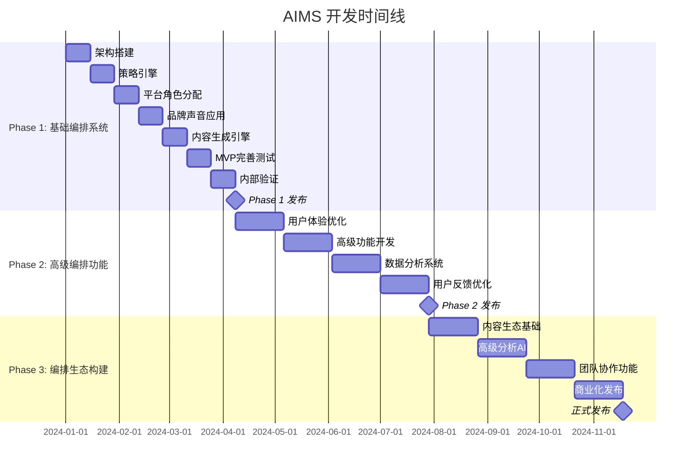

# AIMS 开发进度表

## 📅 总体时间线

**项目周期**：12个月（2024年1月 - 2024年12月）
**开发模式**：敏捷开发，2周一个Sprint
**团队规模**：10人核心团队

## 🎯 三阶段里程碑

## 📋 Phase 1: 基础编排系统（4个月）

### 🎯 阶段目标
验证"战略编排 + 跨平台协同"的核心价值假设

### 📅 详细进度表

| 周次 | 时间段 | 主要任务 | 负责人 | 交付物 | 验收标准 |
|-----|-------|---------|-------|-------|---------|
| **W1-2** | 1/1-1/14 | **编排系统架构搭建** | 技术负责人 | 基础架构 | 开发环境可用 |
| | | - 前端React+TS+Zustand架构 | 前端团队 | 前端框架 | 页面可访问 |
| | | - 后端Node.js+编排引擎架构 | 后端团队 | 后端API | API可调用 |
| | | - PostgreSQL+Redis数据库 | 后端团队 | 数据库 | 数据可存储 |
| | | - CI/CD流水线配置 | DevOps | 部署流程 | 自动部署 |
| **W3-4** | 1/15-1/28 | **策略制定引擎** | AI工程师 | 策略引擎 | 策略可生成 |
| | | - 营销意图解析算法 | AI工程师 | 意图解析 | 准确率>80% |
| | | - 策略模板库建设 | 产品经理 | 模板库 | 4种策略模板 |
| | | - 策略规划界面 | 前端团队 | 规划界面 | 界面可用 |
| | | - 平台角色可视化 | UI设计师 | 可视化组件 | 角色清晰展示 |
| **W5-6** | 1/29-2/11 | **平台角色分配系统** | AI工程师 | 角色分配器 | 角色分配合理 |
| | | - 平台特性分析引擎 | AI工程师 | 分析引擎 | 特性识别准确 |
| | | - 角色分配算法实现 | AI工程师 | 分配算法 | 分配逻辑正确 |
| | | - 角色协调性验证 | 产品经理 | 验证机制 | 协调性检查 |
| | | - 平台角色数据结构 | 后端团队 | 数据模型 | 数据结构完整 |
| **W7-8** | 2/12-2/25 | **品牌声音应用** | AI工程师 | 品牌声音系统 | 一致性>85% |
| | | - 品牌声音模型构建 | AI工程师 | 声音模型 | 模型可用 |
| | | - 内容一致性检查 | AI工程师 | 检查机制 | 检查准确 |
| | | - 品牌声音可视化展示 | 前端团队 | 可视化界面 | 展示清晰 |
| | | - 用户编辑调整界面 | 前端团队 | 编辑界面 | 编辑便捷 |
| **W9-10** | 2/26-3/11 | **内容生成引擎** | AI工程师 | 生成引擎 | 内容质量>8/10 |
| | | - 意图理解和解析 | AI工程师 | 理解引擎 | 理解准确 |
| | | - 基础内容生成 | AI工程师 | 生成算法 | 生成流畅 |
| | | - 平台适配器开发 | 后端团队 | 适配器 | 3平台适配 |
| | | - 生成质量控制 | AI工程师 | 质控机制 | 质量稳定 |
| **W11-12** | 3/12-3/25 | **MVP完善与测试** | 全团队 | MVP产品 | 功能完整可用 |
| | | - 内容预览和编辑 | 前端团队 | 预览编辑器 | 编辑流畅 |
| | | - 批量生成功能 | 后端团队 | 批量处理 | 批量高效 |
| | | - 导出和保存功能 | 全栈团队 | 导出功能 | 导出正常 |
| | | - 功能测试和修复 | 测试工程师 | 测试报告 | Bug<10个 |
| **W13-14** | 3/26-4/8 | **内部验证与优化** | 产品经理 | 验证报告 | 用户满意度>7.5 |
| | | - 内部用户试用 | 产品经理 | 试用反馈 | 10-15用户 |
| | | - 用户体验测试 | UI设计师 | UX报告 | 体验良好 |
| | | - 性能压力测试 | 测试工程师 | 性能报告 | 性能达标 |
| | | - 问题修复优化 | 开发团队 | 优化版本 | 问题解决 |

### 🎯 Phase 1 交付物
- ✅ 可用的MVP产品
- ✅ 策略制定引擎（4种策略模板）
- ✅ 平台角色分配系统（3个平台）
- ✅ 品牌声音学习功能（一致性>85%）
- ✅ 基础内容生成功能（质量>8/10）
- ✅ 10-15名种子用户验证

### 📊 Phase 1 成功指标
- 功能可用性 > 90%
- 用户满意度 > 7.5/10
- 品牌声音学习准确率 > 80%
- 内容生成质量评分 > 8/10
- 系统响应时间 < 3秒
- Bug数量 < 10个

## 📋 Phase 2: 高级编排功能（4个月）

### 🎯 阶段目标
提升编排智能化水平，建立技术领先优势

### 📅 关键里程碑

| 月份 | 主要任务 | 交付物 | 成功指标 |
|-----|---------|-------|---------|
| **第5月** | 用户体验优化 | 意图驱动界面、个性化体验 | 用户留存率>60% |
| **第6月** | 高级功能开发 | 热点监控、内容优化 | 功能使用率>70% |
| **第7月** | 数据分析系统 | 效果分析、可视化仪表板 | 数据准确率>95% |
| **第8月** | 用户反馈优化 | 产品迭代、质量提升 | 用户满意度>8.5/10 |

### 🎯 Phase 2 交付物
- ✅ 完整的用户体验系统
- ✅ 热点监控和内容优化功能
- ✅ 数据分析和效果追踪
- ✅ 100+活跃用户验证
- ✅ 用户留存率>60%

## 📋 Phase 3: 编排生态构建（4个月）

### 🎯 阶段目标
建立编排策略生态，实现网络效应和商业闭环

### 📅 关键里程碑

| 月份 | 主要任务 | 交付物 | 成功指标 |
|-----|---------|-------|---------|
| **第9月** | 内容生态基础 | 模板市场、策略分享平台 | 生态参与者>50人 |
| **第10月** | 高级分析与AI | 跨平台分析、AI能力增强 | 分析准确率>90% |
| **第11月** | 团队协作功能 | 多用户协作、企业功能 | 企业用户>20家 |
| **第12月** | 商业化发布 | 付费系统、正式发布 | 付费用户>500人 |

### 🎯 Phase 3 交付物
- ✅ 完整的生态平台
- ✅ 商业化功能系统
- ✅ 500+付费用户
- ✅ 生态参与者>100人
- ✅ 月收入>50万元

## 👥 团队分工与职责

### 核心团队配置

| 角色 | 姓名 | 主要职责 | Phase 1 重点 |
|-----|------|---------|-------------|
| **产品经理** | TBD | 产品规划、需求管理 | 策略模板设计、用户验证 |
| **技术负责人** | TBD | 技术架构、团队管理 | 编排引擎架构、技术选型 |
| **前端开发** | TBD×2 | UI实现、交互设计 | 策略规划界面、角色可视化 |
| **后端开发** | TBD×2 | API开发、数据处理 | 编排引擎、平台适配器 |
| **AI工程师** | TBD×2 | LLM集成、算法优化 | 意图解析、角色分配算法 |
| **测试工程师** | TBD | 测试计划、质量保证 | 功能测试、性能测试 |
| **UI/UX设计师** | TBD | 视觉设计、用户体验 | 界面设计、交互优化 |

## 📊 项目监控与风险控制

### 每周监控指标
- 开发进度完成率
- 代码质量指标
- 测试覆盖率
- Bug数量和解决率
- 团队工作饱和度

### 风险预警机制
- 🔴 高风险：进度延迟>1周，立即升级处理
- 🟡 中风险：质量指标下降，加强质量控制
- 🟢 低风险：正常监控，定期评估

### 应急预案
- **技术风险**：备选技术方案，外部技术支持
- **人员风险**：关键岗位备份，知识文档化
- **进度风险**：功能优先级调整，资源重新分配

## 🚀 立即行动计划

### 本周任务（Week 1）
1. **环境搭建**（技术负责人）
   - [ ] 创建项目仓库
   - [ ] 配置开发环境
   - [ ] 搭建CI/CD流水线

2. **架构设计**（技术负责人 + 后端团队）
   - [ ] 确定技术栈
   - [ ] 设计数据库结构
   - [ ] 定义API接口规范

3. **UI设计**（UI设计师 + 产品经理）
   - [ ] 设计系统建立
   - [ ] 策略规划界面设计
   - [ ] 交互流程设计

### 下周任务（Week 2）
1. **前端开发**（前端团队）
   - [ ] React项目初始化
   - [ ] 基础组件开发
   - [ ] 路由和状态管理

2. **后端开发**（后端团队）
   - [ ] Node.js项目初始化
   - [ ] 数据库连接和模型
   - [ ] 基础API开发

3. **AI模块**（AI工程师）
   - [ ] LLM服务集成
   - [ ] 意图解析算法设计
   - [ ] 策略模板数据准备

这个开发进度表提供了清晰的时间线、具体的任务分工和明确的验收标准，可以作为项目执行的标准依据。
