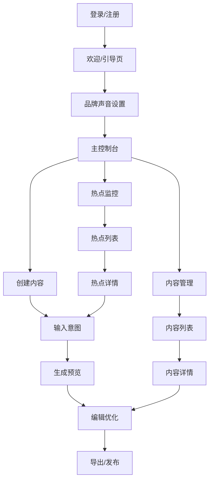
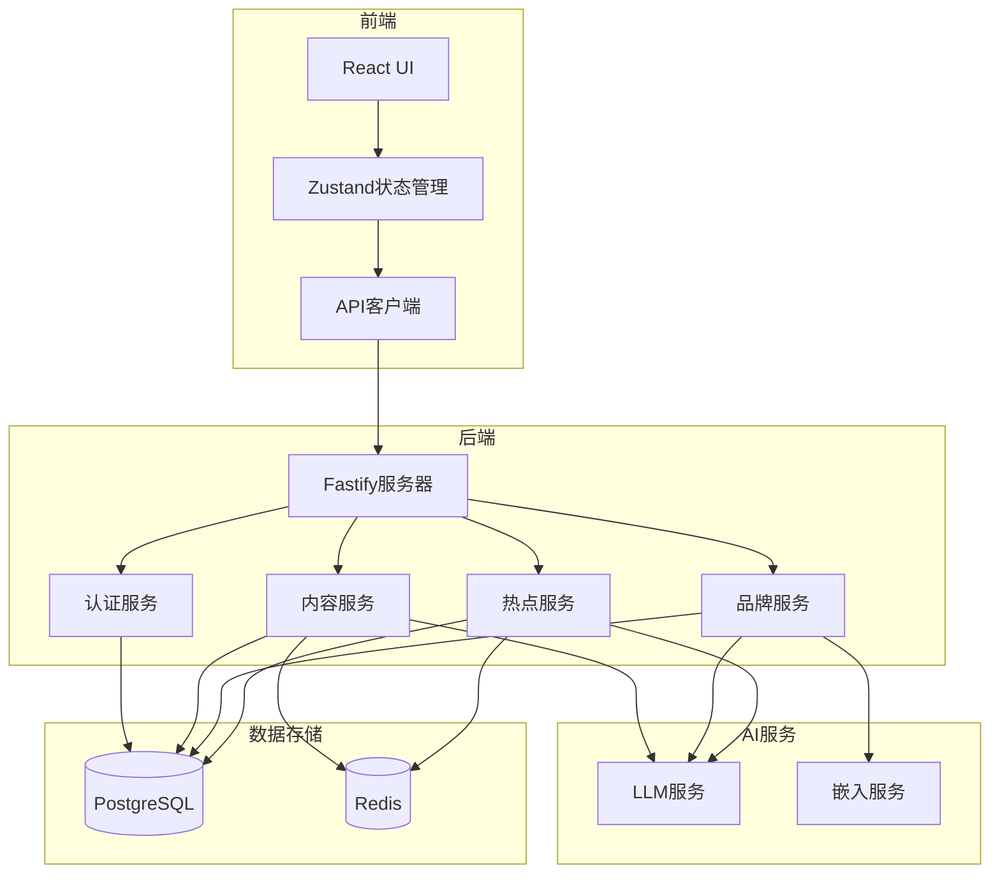

# AIMS MVP功能规格说明

## 📋 MVP定义

### 核心价值主张

**AIMS MVP的核心价值主张**：让营销决策者能够通过战略性内容编排系统，制定完整传播战役，实现跨平台协同传播，将营销活动效果从单点累加升级为协同放大。

### MVP范围界定

**包含功能（战略编排核心）**：
- 基础策略制定引擎
- 平台角色分配系统
- 简化内容联动机制
- 品牌声音一致性保证
- 基础协同效应分析

**不包含功能（高级编排功能）**：
- 复杂策略模板库
- 高级协同优化算法
- 机器学习策略调整
- 实时效果预测
- 企业级团队协作

## 🎯 核心功能详细规格

### 1. 策略制定引擎

#### 功能描述
基于用户输入的营销目标和背景信息，自动解析营销意图，选择合适的传播策略模板，制定包含平台角色分工、时间线规划、内容主题的完整传播战役。

#### 用户流程
1. 用户输入营销目标和背景（如"新产品发布，目标建立行业权威"）
2. 系统解析营销意图，识别目标受众和核心信息
3. 系统推荐传播策略模板（如"产品发布四阶段传播"）
4. 用户确认或调整策略，系统生成完整传播计划

#### 技术规格

```typescript
interface StrategyEngine {
  // 解析营销意图
  parseMarketingIntent(input: string): Promise<MarketingIntent>;

  // 选择策略模板
  selectStrategyTemplate(intent: MarketingIntent): StrategyTemplate;

  // 制定传播计划
  formulateStrategy(template: StrategyTemplate, intent: MarketingIntent): Promise<CampaignStrategy>;

  // 验证策略可行性
  validateStrategy(strategy: CampaignStrategy): Promise<ValidationResult>;
}

interface BrandVoice {
  id: string;
  name: string;
  tone: string[];           // ['专业', '友好', '创新']
  vocabulary: {
    preferredTerms: string[];
    avoidTerms: string[];
  };
  structure: {
    sentenceLength: 'short' | 'medium' | 'long';
    paragraphStyle: 'concise' | 'detailed' | 'balanced';
    transitionPatterns: string[];
  };
  personality: string[];    // ['权威', '创新', '亲和']
  examples: string[];       // 典型内容示例
}
```

#### 实现优先级
1. 基础策略模板库（必须）
2. 营销意图解析（必须）
3. 策略推荐引擎（必须）
4. 策略可视化展示（必须）
5. 高级策略定制（延后）

#### 验收标准
- 支持4种主要营销目标类型识别
- 策略推荐准确率达到80%以上
- 生成完整传播计划覆盖率90%以上
- 支持3-8周传播周期规划

### 2. 平台角色分配系统

#### 功能描述
基于传播策略和平台特性，自动为每个平台分配明确的角色定位，确保各平台在传播战役中发挥不同但协同的作用，避免简单的内容复制。

#### 用户流程
1. 系统基于传播策略分析各平台特性和受众匹配度
2. 自动为每个平台分配角色（如微博-话题引导，知乎-权威建立）
3. 用户可查看和调整平台角色分配
4. 系统根据角色生成对应的内容类型和发布频率建议

#### 技术规格

```typescript
interface PlatformRoleAssigner {
  // 分析平台特性
  analyzePlatformCharacteristics(platform: string): PlatformProfile;

  // 分配平台角色
  assignPlatformRole(
    platform: string,
    strategy: CampaignStrategy,
    platformProfile: PlatformProfile
  ): PlatformRole;

  // 验证角色分配合理性
  validateRoleAssignment(roleMap: Map<string, PlatformRole>): ValidationResult;

  // 优化角色分配
  optimizeRoleDistribution(roleMap: Map<string, PlatformRole>): Map<string, PlatformRole>;
}

interface PlatformProfile {
  platform: string;
  characteristics: {
    contentFormat: string[];
    audienceType: string[];
    interactionStyle: string;
    contentLength: 'short' | 'medium' | 'long';
  };
  strengths: string[];
  limitations: string[];
}

interface PlatformRole {
  platform: string;
  primaryRole: 'awareness_driver' | 'authority_builder' | 'conversion_closer' | 'community_engager';
  secondaryRoles: string[];
  contentTypes: string[];
  publishFrequency: number;
  kpis: string[];
  resourceAllocation: number;
}

interface ContentMatrix {
  baseIntent: string;
  platforms: {
    platform: Platform;
    content: string;
    metadata: {
      wordCount: number;
      readingTime: number;
      keyPoints: string[];
      hashtags?: string[];
    };
  }[];
  generatedAt: Date;
}

enum Platform {
  WEIBO = 'weibo',
  XIAOHONGSHU = 'xiaohongshu',
  ZHIHU = 'zhihu'
}

enum OptimizationGoal {
  ENGAGEMENT = 'engagement',
  CLARITY = 'clarity',
  PERSUASION = 'persuasion',
  BREVITY = 'brevity'
}
```

#### 平台特性适配

| 平台 | 内容长度 | 风格特点 | 特殊元素 |
|-----|---------|---------|---------|
| 微博 | 140字以内 | 简洁、话题性强 | 话题标签、@提及、表情 |
| 小红书 | 1000字左右 | 个人化、种草风格 | 标题吸引力、分段清晰、emoji |
| 知乎 | 2000字以上 | 专业、深度、逻辑性 | 结构化论述、专业术语、引用 |

#### 实现优先级
1. 基础内容生成（必须）
2. 三平台基础适配（必须）
3. 内容预览和编辑（必须）
4. 内容导出功能（必须）
5. 内容发布集成（延后）

### 3. 简化内容联动机制

#### 功能描述
设计基础的跨平台内容联动关系，确保不同平台的内容能够相互引用和强化，形成简单但有效的协同传播效果。

#### 用户流程
1. 系统基于平台角色自动设计内容联动关系
2. 在内容生成时自动添加跨平台引用和话题呼应
3. 用户可预览内容间的联动关系图
4. 用户可手动调整联动强度和引用方式

#### 技术规格

```typescript
interface ContentLinkageDesigner {
  // 设计内容联动关系
  designLinkage(
    platformRoles: Map<string, PlatformRole>,
    contentThemes: string[]
  ): Promise<LinkageMap>;

  // 添加跨平台引用
  addCrossReferences(
    contents: Map<string, string>,
    linkageMap: LinkageMap
  ): Promise<Map<string, string>>;

  // 生成话题呼应
  generateTopicEcho(
    coreTheme: string,
    platforms: string[]
  ): Promise<TopicEchoMap>;

  // 验证联动效果
  validateLinkageEffectiveness(linkageMap: LinkageMap): Promise<EffectivenessScore>;
}

interface Hotspot {
  id: string;
  title: string;
  description: string;
  source: HotspotSource;
  url: string;
  trendingScore: number;      // 热度分数
  discoveredAt: Date;
  expiresAt: Date;            // 预估过期时间
  keywords: string[];
}

enum HotspotSource {
  WEIBO_HOT = 'weibo_hot',
  ZHIHU_HOT = 'zhihu_hot',
  BAIDU_HOT = 'baidu_hot',
  TOUTIAO_HOT = 'toutiao_hot'
}

interface RelevanceScore {
  overall: number;            // 0-1分
  keywordMatch: number;       // 关键词匹配度
  audienceMatch: number;      // 受众匹配度
  brandFit: number;           // 品牌契合度
  explanation: string;        // 相关性解释
}
```

#### 数据源

| 数据源 | 更新频率 | 获取方式 | 数据结构 |
|-------|---------|---------|---------|
| 微博热搜 | 10分钟 | API/爬虫 | 标题、热度值、链接 |
| 知乎热榜 | 1小时 | API/爬虫 | 问题、热度值、链接 |
| 百度热搜 | 1小时 | API/爬虫 | 关键词、搜索指数、链接 |
| 今日头条 | 3小时 | 爬虫 | 标题、阅读量、链接 |

#### 实现优先级
1. 基础热点获取（必须）
2. 关键词相关性筛选（必须）
3. 热点列表展示（必须）
4. 热点内容建议（必须）
5. 热点提醒功能（延后）

### 4. 简单质量检查

#### 功能描述
对生成的内容进行基础质量检查，确保内容符合品牌标准、无明显错误，并提供改进建议。

#### 用户流程
1. 系统自动对生成内容进行质量检查
2. 显示质量评分和具体问题
3. 提供一键修复或手动编辑选项
4. 用户确认修改后再次检查
5. 达到质量标准后可导出/发布

#### 技术规格

```typescript
interface QualityChecker {
  // 检查内容质量
  checkQuality(content: string, criteria: QualityCheckCriteria): Promise<QualityReport>;
  
  // 自动修复问题
  autoFix(content: string, issues: QualityIssue[]): Promise<string>;
  
  // 获取改进建议
  getImprovementSuggestions(content: string): Promise<ImprovementSuggestion[]>;
}

interface QualityCheckCriteria {
  brandConsistency: boolean;  // 品牌一致性检查
  grammar: boolean;           // 语法检查
  spelling: boolean;          // 拼写检查
  readability: boolean;       // 可读性检查
  sensitiveContent: boolean;  // 敏感内容检查
  plagiarism: boolean;        // 抄袭检查
}

interface QualityReport {
  overallScore: number;       // 0-100分
  issues: QualityIssue[];
  metrics: {
    readabilityScore: number;
    brandConsistencyScore: number;
    grammarScore: number;
    uniquenessScore: number;
  };
}

interface QualityIssue {
  type: IssueType;
  severity: 'critical' | 'warning' | 'suggestion';
  description: string;
  location: {
    startIndex: number;
    endIndex: number;
    context: string;
  };
  fixSuggestion?: string;
}
```

#### 质量检查维度

| 检查维度 | 检查内容 | 实现方法 |
|---------|---------|---------|
| 品牌一致性 | 与品牌声音匹配度 | LLM评估 + 关键词检查 |
| 语法和拼写 | 基础语法错误、拼写错误 | 规则检查 + LLM |
| 可读性 | 句子长度、段落结构、复杂度 | 可读性算法 + LLM |
| 敏感内容 | 政治敏感、不当言论、歧视性内容 | 关键词过滤 + LLM |

#### 实现优先级
1. 基础语法和拼写检查（必须）
2. 品牌一致性检查（必须）
3. 可读性评估（必须）
4. 敏感内容检查（必须）
5. 一键修复功能（可选）

## 🖥️ 用户界面设计

### 1. 主要界面流程



### 2. 关键界面设计

#### 品牌声音设置界面
- 内容上传区域（拖放或选择文件）
- 品牌声音分析结果可视化
- 品牌声音特征编辑选项
- 保存和测试按钮

#### 内容创建界面
- 意图输入区（自然语言输入框）
- 平台选择（微博、小红书、知乎）
- 内容生成设置（长度、风格偏好等）
- 生成按钮

#### 内容预览和编辑界面
- 多平台内容并排展示
- 实时编辑功能
- 质量检查结果显示
- 一键优化选项
- 导出/发布按钮

#### 热点监控界面
- 热点列表（按相关性排序）
- 热点详情展示
- 相关性评分可视化
- 一键创建内容按钮

## 🚀 技术实现计划

### 1. 技术架构简图



### 2. 技术栈选择

| 层级 | 技术选择 | 理由 |
|-----|---------|------|
| 前端框架 | React + TypeScript | 成熟稳定、团队熟悉 |
| 状态管理 | Zustand | 轻量级、易用性高 |
| UI组件 | Tailwind + Headless UI | 灵活定制、开发效率高 |
| 后端框架 | Fastify | 高性能、低延迟 |
| 数据库 | PostgreSQL | 可靠性高、关系型数据支持 |
| 缓存 | Redis | 高性能、支持多种数据结构 |
| LLM服务 | OpenAI API + LangChain | 性能优秀、开发效率高 |
| 部署 | Docker + Kubernetes | 可扩展性、容器化管理 |

### 3. API设计概要

#### 品牌声音API
```
POST /api/brand-voices/analyze
POST /api/brand-voices
GET /api/brand-voices
GET /api/brand-voices/:id
PUT /api/brand-voices/:id
DELETE /api/brand-voices/:id
```

#### 内容生成API
```
POST /api/contents/generate
POST /api/contents/adapt-platform
POST /api/contents/check-quality
POST /api/contents
GET /api/contents
GET /api/contents/:id
PUT /api/contents/:id
DELETE /api/contents/:id
```

#### 热点监控API
```
POST /api/hotspots/keywords
GET /api/hotspots
GET /api/hotspots/:id
POST /api/hotspots/:id/generate-content
GET /api/hotspots/sources
```

### 4. 数据模型概要

```typescript
// 用户模型
interface User {
  id: string;
  email: string;
  name: string;
  company?: string;
  createdAt: Date;
  updatedAt: Date;
}

// 品牌声音模型
interface BrandVoice {
  id: string;
  userId: string;
  name: string;
  tone: string[];
  vocabulary: {
    preferred: string[];
    avoid: string[];
  };
  structure: any;
  personality: string[];
  examples: string[];
  createdAt: Date;
  updatedAt: Date;
}

// 内容模型
interface Content {
  id: string;
  userId: string;
  brandVoiceId: string;
  intent: string;
  platforms: {
    platform: string;
    content: string;
    metadata: any;
  }[];
  status: 'draft' | 'published';
  createdAt: Date;
  updatedAt: Date;
}

// 热点模型
interface Hotspot {
  id: string;
  title: string;
  description: string;
  source: string;
  url: string;
  trendingScore: number;
  relevanceScores: Map<string, number>;
  discoveredAt: Date;
  expiresAt: Date;
}
```

## 📅 开发计划

### 1. 开发阶段

| 阶段 | 时间 | 主要任务 |
|-----|------|---------|
| 准备阶段 | 2周 | 环境搭建、技术选型确认、API设计 |
| 核心开发 | 8周 | 四大核心功能实现、基础UI开发 |
| 集成测试 | 2周 | 功能集成、系统测试、性能优化 |
| 用户测试 | 1周 | 内部用户测试、反馈收集、问题修复 |

### 2. 里程碑计划

| 里程碑 | 时间点 | 交付物 |
|-------|-------|-------|
| M1 | 第2周末 | 项目框架搭建完成，API设计确认 |
| M2 | 第6周末 | 品牌声音和内容生成功能完成 |
| M3 | 第10周末 | 热点监控和质量检查功能完成 |
| M4 | 第12周末 | 完整MVP系统交付，可进行内测 |

### 3. 资源需求

| 角色 | 人数 | 主要职责 |
|-----|------|---------|
| 产品经理 | 1 | 需求管理、产品规划、用户反馈 |
| 前端开发 | 2 | UI实现、交互设计、前端架构 |
| 后端开发 | 2 | API开发、数据处理、系统集成 |
| AI工程师 | 1 | LLM集成、提示工程、模型优化 |
| 测试工程师 | 1 | 测试计划、自动化测试、质量保证 |
| 设计师 | 1 | UI/UX设计、视觉设计、交互设计 |

## 🔍 验证与测试计划

### 1. 功能验证指标

| 功能 | 验证指标 | 目标值 |
|-----|---------|-------|
| 品牌声音学习 | 一致性评分 | >80% |
| 内容生成 | 用户满意度 | >75% |
| 热点监控 | 相关性准确率 | >70% |
| 质量检查 | 问题检出率 | >85% |

### 2. 用户测试计划

1. **内部测试**：团队成员使用系统创建真实内容
2. **种子用户测试**：邀请10-15名目标用户进行封闭测试
3. **反馈收集**：结构化问卷 + 深度访谈
4. **迭代优化**：基于反馈快速迭代

### 3. 性能测试指标

| 指标 | 目标值 |
|-----|-------|
| 内容生成响应时间 | <15秒 |
| 热点监控刷新时间 | <10分钟 |
| 系统可用性 | >99.5% |
| 并发用户支持 | >100用户 |

## 🚀 发布策略

### 1. MVP发布计划

1. **内部测试版**：团队内部使用和测试
2. **封闭测试版**：邀请种子用户测试
3. **公开测试版**：限量开放注册
4. **正式版**：全面开放注册

### 2. 营销策略

1. **内容示范**：用AIMS生成的内容做营销
2. **案例研究**：记录种子用户成功案例
3. **对比展示**：展示使用前后的效率和质量提升
4. **免费试用**：提供14天免费试用

### 3. 用户获取策略

1. **内容营销**：博客、社交媒体分享
2. **社区建设**：建立用户社区，分享经验
3. **口碑推广**：鼓励用户分享和推荐
4. **行业合作**：与营销机构和自媒体合作
