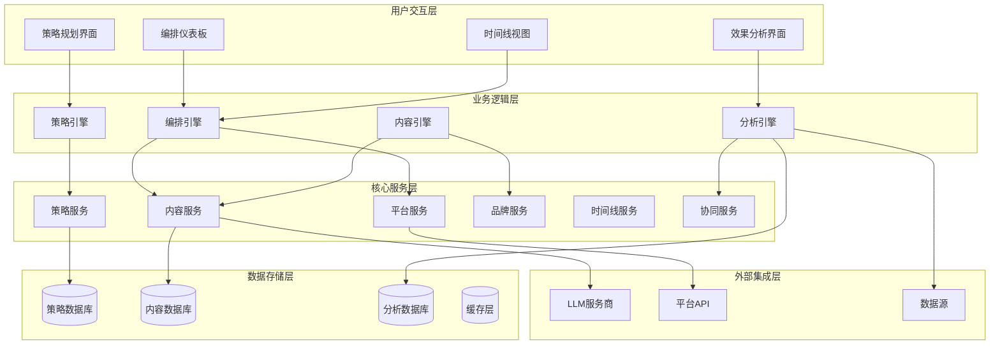

# AIMS 内容编排产品架构

## 🎯 架构设计理念转变

### 从内容生成到内容编排

**原架构理念**：
```
用户输入 → AI生成 → 平台适配 → 内容输出
（单点生成，缺乏整体策略）
```

**新架构理念**：
```
营销策略 → 战略编排 → 协同生成 → 效果优化
（系统编排，战略性传播）
```

### 篮球战术系统与产品架构对应

| 篮球系统 | 产品架构层 | 核心功能 |
|---------|-----------|---------|
| 教练战术板 | 策略规划层 | 营销策略制定、目标设定 |
| 球员定位系统 | 平台编排层 | 平台角色分配、内容分工 |
| 战术执行系统 | 内容生成层 | 协同内容生成、品牌一致性 |
| 数据分析系统 | 效果分析层 | 跨平台数据整合、协同效应分析 |
| 临场指挥系统 | 优化调整层 | 实时策略调整、效果优化 |

## 🏗️ 产品架构总览



## 🎮 核心引擎设计

### 1. 策略引擎 (Strategy Engine)

```typescript
class StrategyEngine {
  private strategyParser: StrategyParser;
  private templateLibrary: StrategyTemplateLibrary;
  private objectiveAnalyzer: ObjectiveAnalyzer;
  
  // 核心方法：策略制定
  async formulateStrategy(input: StrategyInput): Promise<MarketingStrategy> {
    // 1. 解析营销目标
    const objective = await this.objectiveAnalyzer.analyze(input.description);
    
    // 2. 分析目标受众
    const audience = await this.analyzeTargetAudience(input);
    
    // 3. 选择策略模板
    const template = this.templateLibrary.selectTemplate(objective, input.context);
    
    // 4. 定制化策略
    const customizedStrategy = await this.customizeStrategy(template, input, audience);
    
    // 5. 验证策略可行性
    const validatedStrategy = await this.validateStrategy(customizedStrategy);
    
    return validatedStrategy;
  }
  
  // 策略定制化
  private async customizeStrategy(
    template: StrategyTemplate,
    input: StrategyInput,
    audience: AudienceProfile
  ): Promise<MarketingStrategy> {
    return {
      objective: template.objective,
      targetAudience: audience,
      keyMessages: await this.extractKeyMessages(input.description),
      platforms: this.selectOptimalPlatforms(audience, template),
      timeline: this.generateTimeline(template, input.urgency),
      budget: this.calculateBudget(template, input.resources),
      kpis: this.defineKPIs(template.objective, input.goals)
    };
  }
  
  // 平台选择优化
  private selectOptimalPlatforms(
    audience: AudienceProfile,
    template: StrategyTemplate
  ): PlatformSelection[] {
    const platformScores = template.supportedPlatforms.map(platform => ({
      platform,
      audienceMatch: this.calculateAudienceMatch(platform, audience),
      objectiveAlignment: this.calculateObjectiveAlignment(platform, template.objective),
      resourceRequirement: this.calculateResourceRequirement(platform),
      competitiveAdvantage: this.calculateCompetitiveAdvantage(platform, audience)
    }));
    
    // 基于综合评分选择最优平台组合
    return this.optimizePlatformMix(platformScores);
  }
}
```

### 2. 编排引擎 (Orchestration Engine)

```typescript
class OrchestrationEngine {
  private platformRoleAssigner: PlatformRoleAssigner;
  private contentConnectionDesigner: ContentConnectionDesigner;
  private timelineOrchestrator: TimelineOrchestrator;
  private synergyOptimizer: SynergyOptimizer;
  
  // 核心方法：内容编排
  async orchestrateContent(strategy: MarketingStrategy): Promise<ContentOrchestration> {
    // 1. 分配平台角色
    const platformRoles = await this.platformRoleAssigner.assignRoles(strategy);
    
    // 2. 设计内容联动
    const contentConnections = await this.contentConnectionDesigner.design(
      strategy, 
      platformRoles
    );
    
    // 3. 编排时间线
    const timeline = await this.timelineOrchestrator.orchestrate(
      strategy, 
      platformRoles, 
      contentConnections
    );
    
    // 4. 优化协同效应
    const optimizedOrchestration = await this.synergyOptimizer.optimize({
      strategy,
      platformRoles,
      contentConnections,
      timeline
    });
    
    return optimizedOrchestration;
  }
  
  // 平台角色分配详细实现
  private async assignDetailedRoles(strategy: MarketingStrategy): Promise<DetailedPlatformRoles> {
    const roles = new Map<string, DetailedPlatformRole>();
    
    for (const platform of strategy.platforms) {
      const role = await this.calculateOptimalRole(platform, strategy);
      roles.set(platform.name, {
        primaryRole: role.primary,
        secondaryRoles: role.secondary,
        contentTypes: this.getContentTypesForRole(role, platform),
        publishingFrequency: this.calculateOptimalFrequency(role, platform, strategy),
        audienceSegment: this.mapAudienceToRole(role, strategy.targetAudience),
        kpis: this.defineRoleKPIs(role, platform, strategy.objective),
        resourceAllocation: this.calculateResourceAllocation(role, platform, strategy.budget)
      });
    }
    
    return roles;
  }
  
  // 内容联动设计详细实现
  private async designAdvancedConnections(
    strategy: MarketingStrategy,
    roles: DetailedPlatformRoles
  ): Promise<AdvancedContentConnections> {
    return {
      // 话题联动网络
      topicNetwork: await this.designTopicNetwork(strategy, roles),
      
      // 用户旅程地图
      userJourneyMap: await this.designUserJourneyMap(strategy, roles),
      
      // 内容引用关系
      referenceGraph: await this.buildReferenceGraph(strategy, roles),
      
      // 时间序列联动
      temporalConnections: await this.designTemporalConnections(strategy, roles),
      
      // 情感弧线设计
      emotionalArc: await this.designEmotionalArc(strategy, roles)
    };
  }
}
```

### 3. 内容引擎 (Content Engine)

```typescript
class ContentEngine {
  private brandVoiceService: BrandVoiceService;
  private contentGenerator: ContentGenerator;
  private platformAdapter: PlatformAdapter;
  private qualityController: QualityController;
  
  // 核心方法：协同内容生成
  async generateOrchestrated(
    orchestration: ContentOrchestration,
    brandVoice: BrandVoice
  ): Promise<OrchestrationResult> {
    const results = new Map<string, PlatformContentSet>();
    
    // 1. 按时间线顺序生成内容
    for (const timeSlot of orchestration.timeline.getTimeSlots()) {
      const slotResults = await this.generateTimeSlotContent(
        timeSlot,
        orchestration,
        brandVoice,
        results // 传入已生成的内容，用于联动
      );
      
      // 2. 应用内容联动关系
      const linkedContent = await this.applyContentLinkage(
        slotResults,
        orchestration.contentConnections,
        results
      );
      
      // 3. 质量检查和优化
      const qualityChecked = await this.qualityController.checkAndOptimize(
        linkedContent,
        brandVoice,
        orchestration.strategy
      );
      
      // 4. 更新结果集
      this.updateResults(results, qualityChecked);
    }
    
    // 5. 最终协同效应优化
    const finalOptimized = await this.optimizeFinalSynergy(results, orchestration);
    
    return {
      contentMatrix: finalOptimized,
      synergyScore: await this.calculateSynergyScore(finalOptimized),
      qualityReport: await this.generateQualityReport(finalOptimized),
      optimizationSuggestions: await this.generateOptimizationSuggestions(finalOptimized)
    };
  }
  
  // 时间槽内容生成
  private async generateTimeSlotContent(
    timeSlot: TimeSlot,
    orchestration: ContentOrchestration,
    brandVoice: BrandVoice,
    existingContent: Map<string, PlatformContentSet>
  ): Promise<Map<string, Content[]>> {
    const slotContent = new Map<string, Content[]>();
    
    for (const platformTask of timeSlot.platformTasks) {
      const platform = platformTask.platform;
      const role = orchestration.platformRoles.get(platform);
      
      // 生成平台特定内容
      const content = await this.contentGenerator.generate({
        platform,
        role: role.primaryRole,
        theme: platformTask.theme,
        brandVoice,
        context: {
          timeSlot,
          existingContent: existingContent.get(platform) || [],
          crossPlatformContext: this.buildCrossPlatformContext(existingContent),
          strategicContext: orchestration.strategy
        }
      });
      
      slotContent.set(platform, content);
    }
    
    return slotContent;
  }
  
  // 应用内容联动关系
  private async applyContentLinkage(
    slotContent: Map<string, Content[]>,
    connections: AdvancedContentConnections,
    existingContent: Map<string, PlatformContentSet>
  ): Promise<Map<string, Content[]>> {
    const linkedContent = new Map<string, Content[]>();
    
    for (const [platform, contents] of slotContent.entries()) {
      const enhanced = await Promise.all(contents.map(async content => {
        // 添加话题联动
        const topicEnhanced = await this.addTopicLinkage(
          content,
          connections.topicNetwork,
          platform
        );
        
        // 添加跨平台引用
        const referenceEnhanced = await this.addCrossReferences(
          topicEnhanced,
          connections.referenceGraph,
          existingContent
        );
        
        // 添加用户引导
        const flowEnhanced = await this.addUserFlowGuidance(
          referenceEnhanced,
          connections.userJourneyMap,
          platform
        );
        
        return flowEnhanced;
      }));
      
      linkedContent.set(platform, enhanced);
    }
    
    return linkedContent;
  }
}
```

### 4. 分析引擎 (Analytics Engine)

```typescript
class AnalyticsEngine {
  private dataCollector: CrossPlatformDataCollector;
  private synergyAnalyzer: SynergyAnalyzer;
  private performancePredictor: PerformancePredictor;
  private optimizationAdvisor: OptimizationAdvisor;
  
  // 核心方法：协同效应分析
  async analyzeSynergy(
    orchestration: ContentOrchestration,
    performanceData: CrossPlatformPerformanceData
  ): Promise<SynergyAnalysisReport> {
    // 1. 收集跨平台数据
    const consolidatedData = await this.dataCollector.consolidate(performanceData);
    
    // 2. 分析协同效应
    const synergyAnalysis = await this.synergyAnalyzer.analyze(
      orchestration,
      consolidatedData
    );
    
    // 3. 预测优化效果
    const optimizationPredictions = await this.performancePredictor.predict(
      orchestration,
      synergyAnalysis
    );
    
    // 4. 生成优化建议
    const optimizationAdvice = await this.optimizationAdvisor.advise(
      orchestration,
      synergyAnalysis,
      optimizationPredictions
    );
    
    return {
      currentSynergy: synergyAnalysis,
      optimizationPotential: optimizationPredictions,
      recommendations: optimizationAdvice,
      actionPlan: this.generateActionPlan(optimizationAdvice)
    };
  }
  
  // 协同效应详细分析
  private async analyzeDetailedSynergy(
    orchestration: ContentOrchestration,
    data: ConsolidatedPerformanceData
  ): Promise<DetailedSynergyAnalysis> {
    return {
      // 平台间流量分析
      crossPlatformFlow: await this.analyzeCrossPlatformFlow(data),
      
      // 话题协同分析
      topicSynergy: await this.analyzeTopicSynergy(orchestration, data),
      
      // 时间协同分析
      temporalSynergy: await this.analyzeTemporalSynergy(orchestration, data),
      
      // 受众重叠分析
      audienceOverlap: await this.analyzeAudienceOverlap(data),
      
      // 内容互补分析
      contentComplementarity: await this.analyzeContentComplementarity(orchestration, data),
      
      // 品牌一致性分析
      brandConsistency: await this.analyzeBrandConsistency(orchestration, data)
    };
  }
  
  // 跨平台流量分析
  private async analyzeCrossPlatformFlow(data: ConsolidatedPerformanceData): Promise<FlowAnalysis> {
    const flowMetrics = {
      directFlow: this.calculateDirectFlow(data),
      indirectFlow: this.calculateIndirectFlow(data),
      flowEfficiency: this.calculateFlowEfficiency(data),
      conversionFunnel: this.buildConversionFunnel(data)
    };
    
    return {
      metrics: flowMetrics,
      insights: this.generateFlowInsights(flowMetrics),
      optimizations: this.suggestFlowOptimizations(flowMetrics)
    };
  }
}
```

## 🎨 用户界面设计

### 1. 策略规划界面

```typescript
interface StrategyPlanningUI {
  // 策略输入区域
  strategyInput: {
    objectiveSelector: ObjectiveSelector;
    audienceDefiner: AudienceDefiner;
    messageExtractor: MessageExtractor;
    platformSelector: PlatformSelector;
    timelineBuilder: TimelineBuilder;
  };
  
  // 策略预览区域
  strategyPreview: {
    strategyOverview: StrategyOverview;
    platformRoleMap: PlatformRoleMap;
    contentPlan: ContentPlan;
    expectedOutcomes: ExpectedOutcomes;
  };
  
  // 策略验证区域
  strategyValidation: {
    feasibilityCheck: FeasibilityCheck;
    resourceRequirement: ResourceRequirement;
    riskAssessment: RiskAssessment;
    successPrediction: SuccessPrediction;
  };
}
```

### 2. 编排仪表板

```typescript
interface OrchestrationDashboard {
  // 全局视图
  globalView: {
    campaignOverview: CampaignOverview;
    platformStatus: PlatformStatus[];
    timelineProgress: TimelineProgress;
    synergyScore: SynergyScore;
  };
  
  // 平台视图
  platformView: {
    platformTabs: PlatformTab[];
    contentPreview: ContentPreview;
    rolePerformance: RolePerformance;
    crossPlatformConnections: CrossPlatformConnections;
  };
  
  // 内容工作区
  contentWorkspace: {
    contentEditor: ContentEditor;
    linkageDesigner: LinkageDesigner;
    qualityChecker: QualityChecker;
    publishScheduler: PublishScheduler;
  };
}
```

### 3. 时间线视图

```typescript
interface TimelineView {
  // 甘特图视图
  ganttChart: {
    campaignPhases: Phase[];
    platformTimelines: PlatformTimeline[];
    milestones: Milestone[];
    dependencies: Dependency[];
  };
  
  // 日历视图
  calendarView: {
    monthlyView: MonthlyCalendar;
    weeklyView: WeeklyCalendar;
    dailyView: DailyCalendar;
    contentSchedule: ContentSchedule[];
  };
  
  // 流程视图
  flowView: {
    userJourneyFlow: UserJourneyFlow;
    contentFlowDiagram: ContentFlowDiagram;
    platformInteractionFlow: PlatformInteractionFlow;
  };
}
```

## 📊 数据模型设计

### 1. 策略数据模型

```typescript
interface StrategyDataModel {
  // 策略基础信息
  strategy: {
    id: string;
    name: string;
    objective: MarketingObjective;
    description: string;
    targetAudience: AudienceProfile;
    keyMessages: KeyMessage[];
    timeline: StrategyTimeline;
    budget: BudgetAllocation;
    kpis: KPIDefinition[];
    status: StrategyStatus;
    createdAt: Date;
    updatedAt: Date;
  };
  
  // 平台配置
  platformConfigs: {
    [platform: string]: {
      role: PlatformRole;
      contentTypes: ContentType[];
      publishFrequency: PublishFrequency;
      resourceAllocation: number;
      targetMetrics: MetricTarget[];
    };
  };
  
  // 内容联动配置
  linkageConfig: {
    topicConnections: TopicConnection[];
    referenceRelations: ReferenceRelation[];
    userFlowPaths: UserFlowPath[];
    temporalSequences: TemporalSequence[];
  };
}
```

### 2. 内容数据模型

```typescript
interface ContentDataModel {
  // 内容基础信息
  content: {
    id: string;
    strategyId: string;
    platform: string;
    contentType: ContentType;
    theme: string;
    phase: CampaignPhase;
    status: ContentStatus;
    createdAt: Date;
    publishedAt?: Date;
  };
  
  // 内容详情
  contentDetails: {
    title?: string;
    body: string;
    media?: MediaAsset[];
    hashtags?: string[];
    mentions?: string[];
    links?: Link[];
  };
  
  // 联动关系
  linkages: {
    parentContent?: string;
    childContents: string[];
    crossReferences: CrossReference[];
    userFlowPosition: FlowPosition;
  };
  
  // 性能数据
  performance: {
    reach: number;
    impressions: number;
    engagement: EngagementMetrics;
    conversions: ConversionMetrics;
    synergy: SynergyMetrics;
  };
}
```

## 🚀 技术实现路径

### Phase 1: 核心编排引擎（2个月）
1. 策略引擎基础实现
2. 平台角色分配系统
3. 基础内容联动机制
4. 简单时间线编排

### Phase 2: 高级编排功能（2个月）
1. 复杂策略模板支持
2. 智能协同优化
3. 高级分析系统
4. 用户界面完善

### Phase 3: 智能优化系统（2个月）
1. 机器学习优化
2. 实时策略调整
3. 预测分析系统
4. 自动化建议引擎

这个产品架构将AIMS从简单的内容生成工具升级为真正的战略性内容编排系统，实现了从"单点生成"到"系统编排"的根本性转变。
