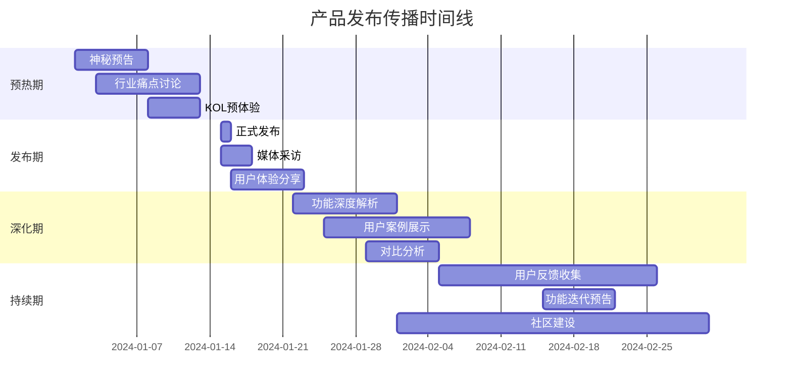

# AIMS 战略传播框架

## 🎯 传播策略框架概述

### 核心理念：从单点发布到战略编排

**传统内容营销**：
```
各平台独立发布 → 内容重复 → 效果分散 → 资源浪费
```

**AIMS战略编排**：
```
统一策略规划 → 平台角色分工 → 内容协同联动 → 效果放大
```

### 篮球战术体系在传播策略中的应用

| 篮球战术 | 传播策略 | 实际应用 |
|---------|---------|---------|
| 快攻战术 | 热点快速响应 | 微博第一时间发声，其他平台跟进深化 |
| 阵地战 | 品牌建设传播 | 知乎建立权威，小红书展示场景，形成认知 |
| 挡拆配合 | 平台互相引流 | 微博制造话题，知乎提供解答，形成流量闭环 |
| 全场紧逼 | 危机公关应对 | 全平台统一声音，快速控制舆论走向 |
| 区域防守 | 竞品应对策略 | 各平台分工监控，协同应对竞争威胁 |

## 📋 传播策略模板库

### 1. 产品发布策略模板

#### 策略概述
```yaml
策略名称: 产品发布四阶段传播
适用场景: 新产品/功能发布
传播周期: 4-6周
核心目标: 最大化产品认知和试用转化
```

#### 阶段规划


#### 平台角色分工
```typescript
interface ProductLaunchStrategy {
  platforms: {
    weibo: {
      role: '话题引导 + 快速传播',
      contentTypes: ['预告海报', '发布动态', '用户反馈', '数据分享'],
      kpis: ['话题阅读量', '转发数', '评论互动'],
      timeline: {
        预热期: '神秘预告 + 话题创建',
        发布期: '实时发布动态 + KOL转发',
        深化期: '用户反馈分享 + 数据展示',
        持续期: '持续话题维护 + 社区互动'
      }
    },
    
    zhihu: {
      role: '权威建立 + 专业解析',
      contentTypes: ['行业分析', '技术解读', '对比评测', '问答互动'],
      kpis: ['文章阅读量', '点赞数', '专业评论'],
      timeline: {
        预热期: '行业痛点分析 + 解决方案探讨',
        发布期: '产品技术原理深度解析',
        深化期: '与竞品详细对比分析',
        持续期: '用户问题解答 + 应用场景讨论'
      }
    },
    
    xiaohongshu: {
      role: '场景展示 + 用户种草',
      contentTypes: ['使用场景', '效果对比', '教程分享', '心得体验'],
      kpis: ['笔记收藏', '点赞数', '评论互动'],
      timeline: {
        预热期: '现有工具痛点吐槽 + 期待表达',
        发布期: '首次体验分享 + 效果展示',
        深化期: '不同场景应用案例',
        持续期: '进阶使用技巧 + 创意应用'
      }
    },
    
    douyin: {
      role: '直观演示 + 病毒传播',
      contentTypes: ['功能演示', '对比视频', '教程视频', '创意应用'],
      kpis: ['播放量', '点赞数', '分享数'],
      timeline: {
        预热期: '问题场景短剧 + 悬念设置',
        发布期: '产品功能完整演示',
        深化期: '详细使用教程 + 技巧分享',
        持续期: '用户创意作品 + 挑战赛'
      }
    }
  }
}
```

#### 内容联动机制
```typescript
interface ContentLinkage {
  // 话题呼应
  topicEcho: {
    coreHashtag: '#AI改变工作方式#',
    platformVariations: {
      weibo: '#AI改变工作方式# #效率工具#',
      zhihu: '人工智能如何改变我们的工作方式？',
      xiaohongshu: '#效率提升 #AI工具 #工作神器#',
      douyin: '#AI工具 #效率神器 #工作技巧#'
    }
  },
  
  // 内容引用
  crossReference: {
    weiboToZhihu: '微博话题讨论 → 知乎深度解析',
    zhihuToXiaohongshu: '知乎理论支撑 → 小红书实践验证',
    xiaohongshuToDouyin: '小红书场景展示 → 抖音教程演示',
    douyinToWeibo: '抖音创意内容 → 微博话题讨论'
  },
  
  // 用户引导
  userFlow: {
    awareness: 'weibo话题 → zhihu深度了解',
    interest: 'zhihu专业内容 → xiaohongshu场景共鸣',
    consideration: 'xiaohongshu真实体验 → douyin教程学习',
    action: 'douyin使用演示 → 官网注册试用'
  }
}
```

### 2. 品牌建设策略模板

#### 策略概述
```yaml
策略名称: 品牌权威建设长期传播
适用场景: 品牌认知提升、行业地位建立
传播周期: 3-6个月
核心目标: 建立行业权威地位和用户信任
```

#### 内容支柱体系
```typescript
interface BrandBuildingPillars {
  pillar1: {
    name: '行业洞察',
    weight: 0.3,
    platforms: ['zhihu', 'weibo'],
    contentTypes: ['趋势分析', '数据报告', '观点文章'],
    frequency: '每周2-3篇',
    kpis: ['专业度认知', '行业影响力']
  },
  
  pillar2: {
    name: '产品价值',
    weight: 0.25,
    platforms: ['xiaohongshu', 'douyin'],
    contentTypes: ['场景展示', '效果对比', '用户故事'],
    frequency: '每周3-4篇',
    kpis: ['产品认知', '使用意愿']
  },
  
  pillar3: {
    name: '用户成功',
    weight: 0.25,
    platforms: ['weibo', 'xiaohongshu'],
    contentTypes: ['案例分享', '用户访谈', '成果展示'],
    frequency: '每周2-3篇',
    kpis: ['用户满意度', '口碑传播']
  },
  
  pillar4: {
    name: '技术创新',
    weight: 0.2,
    platforms: ['zhihu', 'douyin'],
    contentTypes: ['技术解读', '创新展示', '未来展望'],
    frequency: '每周1-2篇',
    kpis: ['技术认知', '创新形象']
  }
}
```

### 3. 危机公关策略模板

#### 策略概述
```yaml
策略名称: 危机公关快速响应
适用场景: 负面舆情、产品问题、竞争攻击
传播周期: 1-2周
核心目标: 快速控制舆论、恢复品牌形象
```

#### 响应机制
```typescript
interface CrisisResponse {
  // 第一阶段：快速响应（0-2小时）
  immediateResponse: {
    weibo: {
      action: '官方声明发布',
      content: '简洁回应 + 解决承诺',
      tone: '诚恳、负责、专业'
    },
    zhihu: {
      action: '详细说明准备',
      content: '问题分析 + 解决方案',
      tone: '理性、专业、透明'
    }
  },
  
  // 第二阶段：深度解释（2-24小时）
  detailedResponse: {
    zhihu: {
      action: '详细解释发布',
      content: '问题原因 + 解决过程 + 预防措施',
      tone: '专业、透明、负责'
    },
    xiaohongshu: {
      action: '用户关怀内容',
      content: '用户影响说明 + 补偿方案',
      tone: '贴心、负责、真诚'
    }
  },
  
  // 第三阶段：形象修复（1-2周）
  imageRecovery: {
    allPlatforms: {
      action: '正面内容推送',
      content: '改进成果 + 用户反馈 + 价值重申',
      tone: '积极、专业、可信'
    }
  }
}
```

## 🎮 策略执行引擎

### 1. 策略选择器

```typescript
class StrategySelector {
  // 根据营销目标选择策略模板
  selectStrategy(objective: MarketingObjective, context: MarketingContext): StrategyTemplate {
    const strategyMap = {
      'PRODUCT_LAUNCH': this.getProductLaunchStrategy(context),
      'BRAND_BUILDING': this.getBrandBuildingStrategy(context),
      'CRISIS_MANAGEMENT': this.getCrisisManagementStrategy(context),
      'LEAD_GENERATION': this.getLeadGenerationStrategy(context),
      'SALES_CONVERSION': this.getSalesConversionStrategy(context)
    };
    
    return strategyMap[objective] || this.getDefaultStrategy(context);
  }
  
  // 产品发布策略
  private getProductLaunchStrategy(context: MarketingContext): StrategyTemplate {
    return {
      name: '产品发布四阶段传播',
      duration: this.calculateDuration(context.productComplexity),
      phases: this.generateLaunchPhases(context),
      platformRoles: this.assignLaunchRoles(context.platforms),
      contentPlan: this.generateLaunchContentPlan(context),
      kpis: this.defineLaunchKPIs(context)
    };
  }
  
  // 品牌建设策略
  private getBrandBuildingStrategy(context: MarketingContext): StrategyTemplate {
    return {
      name: '品牌权威建设长期传播',
      duration: this.calculateBrandBuildingDuration(context.brandMaturity),
      phases: this.generateBrandPhases(context),
      platformRoles: this.assignBrandRoles(context.platforms),
      contentPillars: this.defineBrandPillars(context),
      kpis: this.defineBrandKPIs(context)
    };
  }
}
```

### 2. 时间编排器

```typescript
class TimelineOrchestrator {
  // 生成传播时间线
  generateTimeline(strategy: StrategyTemplate): CampaignTimeline {
    const timeline = new CampaignTimeline();
    
    // 1. 设置总体时间框架
    timeline.setDuration(strategy.duration);
    
    // 2. 划分传播阶段
    strategy.phases.forEach(phase => {
      timeline.addPhase({
        name: phase.name,
        startDate: this.calculatePhaseStart(phase, timeline),
        endDate: this.calculatePhaseEnd(phase, timeline),
        objectives: phase.objectives,
        platforms: phase.platforms
      });
    });
    
    // 3. 设置关键节点
    this.setMilestones(timeline, strategy);
    
    // 4. 安排内容发布
    this.scheduleContent(timeline, strategy);
    
    return timeline;
  }
  
  // 设置关键里程碑
  private setMilestones(timeline: CampaignTimeline, strategy: StrategyTemplate): void {
    const milestones = [
      {
        name: '策略启动',
        type: 'campaign_start',
        importance: 'high',
        platforms: 'all'
      },
      {
        name: '核心发布',
        type: 'main_launch',
        importance: 'critical',
        platforms: 'primary'
      },
      {
        name: '效果评估',
        type: 'performance_review',
        importance: 'medium',
        platforms: 'all'
      },
      {
        name: '策略调整',
        type: 'strategy_adjustment',
        importance: 'high',
        platforms: 'underperforming'
      }
    ];
    
    milestones.forEach(milestone => {
      timeline.addMilestone({
        ...milestone,
        date: this.calculateMilestoneDate(milestone, timeline, strategy)
      });
    });
  }
  
  // 安排内容发布计划
  private scheduleContent(timeline: CampaignTimeline, strategy: StrategyTemplate): void {
    strategy.contentPlan.forEach(contentItem => {
      const publishDate = this.calculatePublishDate(contentItem, timeline);
      const optimalTime = this.getOptimalPublishTime(contentItem.platform);
      
      timeline.addContentSchedule({
        platform: contentItem.platform,
        contentType: contentItem.type,
        publishDate,
        publishTime: optimalTime,
        theme: contentItem.theme,
        dependencies: contentItem.dependencies,
        status: 'planned'
      });
    });
  }
}
```

### 3. 协同效应计算器

```typescript
class SynergyCalculator {
  // 计算平台协同效应
  calculateSynergy(contentMatrix: ContentMatrix, connections: ContentConnectionGraph): SynergyScore {
    const scores = {
      topicCoherence: this.calculateTopicCoherence(contentMatrix),
      temporalAlignment: this.calculateTemporalAlignment(contentMatrix),
      audienceOverlap: this.calculateAudienceOverlap(contentMatrix),
      crossPlatformFlow: this.calculateCrossPlatformFlow(connections),
      messageAmplification: this.calculateMessageAmplification(contentMatrix)
    };
    
    return {
      individual: scores,
      weighted: this.calculateWeightedScore(scores),
      overall: this.calculateOverallSynergy(scores),
      recommendations: this.generateOptimizationRecommendations(scores)
    };
  }
  
  // 计算话题一致性
  private calculateTopicCoherence(matrix: ContentMatrix): number {
    const allTopics = matrix.getAllTopics();
    const coreTopics = this.extractCoreTopics(allTopics);
    const coherenceScore = this.measureTopicOverlap(allTopics, coreTopics);
    
    return coherenceScore;
  }
  
  // 计算时间对齐度
  private calculateTemporalAlignment(matrix: ContentMatrix): number {
    const publishSchedule = matrix.getPublishSchedule();
    const optimalTiming = this.calculateOptimalTiming(publishSchedule);
    const alignmentScore = this.measureTimingAlignment(publishSchedule, optimalTiming);
    
    return alignmentScore;
  }
  
  // 计算跨平台流量
  private calculateCrossPlatformFlow(connections: ContentConnectionGraph): number {
    const flowPaths = connections.getFlowPaths();
    const actualFlow = this.measureActualFlow(flowPaths);
    const potentialFlow = this.calculatePotentialFlow(flowPaths);
    
    return actualFlow / potentialFlow;
  }
}
```

## 📊 策略效果评估

### 1. 关键指标体系

```typescript
interface StrategyKPIs {
  // 覆盖指标
  reach: {
    totalReach: number;           // 总覆盖人数
    uniqueReach: number;          // 去重覆盖人数
    crossPlatformReach: number;   // 跨平台覆盖人数
    reachGrowthRate: number;      // 覆盖增长率
  };
  
  // 参与指标
  engagement: {
    totalEngagement: number;      // 总互动数
    engagementRate: number;       // 互动率
    crossPlatformEngagement: number; // 跨平台互动
    engagementQuality: number;    // 互动质量分
  };
  
  // 转化指标
  conversion: {
    awarenessToInterest: number;  // 认知到兴趣转化率
    interestToConsideration: number; // 兴趣到考虑转化率
    considerationToAction: number;   // 考虑到行动转化率
    overallConversionRate: number;   // 整体转化率
  };
  
  // 协同指标
  synergy: {
    platformSynergyScore: number; // 平台协同分
    contentCoherenceScore: number; // 内容一致性分
    timingOptimizationScore: number; // 时机优化分
    flowEfficiencyScore: number;  // 流量效率分
  };
}
```

### 2. 效果分析引擎

```typescript
class PerformanceAnalyzer {
  // 分析策略执行效果
  analyzePerformance(campaign: Campaign, actualData: PerformanceData): AnalysisReport {
    return {
      overallPerformance: this.calculateOverallPerformance(campaign, actualData),
      platformPerformance: this.analyzePlatformPerformance(campaign, actualData),
      synergyAnalysis: this.analyzeSynergyEffects(campaign, actualData),
      timelineAnalysis: this.analyzeTimelineExecution(campaign, actualData),
      optimizationSuggestions: this.generateOptimizationSuggestions(campaign, actualData)
    };
  }
  
  // 分析协同效应
  private analyzeSynergyEffects(campaign: Campaign, data: PerformanceData): SynergyAnalysis {
    const expectedSynergy = campaign.strategy.expectedSynergy;
    const actualSynergy = this.calculateActualSynergy(data);
    
    return {
      synergyGap: actualSynergy - expectedSynergy,
      contributingFactors: this.identifyContributingFactors(data),
      underperformingAreas: this.identifyUnderperformingAreas(data),
      improvementOpportunities: this.identifyImprovementOpportunities(data)
    };
  }
  
  // 生成优化建议
  private generateOptimizationSuggestions(
    campaign: Campaign, 
    data: PerformanceData
  ): OptimizationSuggestion[] {
    const suggestions: OptimizationSuggestion[] = [];
    
    // 平台角色优化
    const roleOptimizations = this.suggestRoleOptimizations(campaign, data);
    suggestions.push(...roleOptimizations);
    
    // 内容联动优化
    const linkageOptimizations = this.suggestLinkageOptimizations(campaign, data);
    suggestions.push(...linkageOptimizations);
    
    // 时间安排优化
    const timingOptimizations = this.suggestTimingOptimizations(campaign, data);
    suggestions.push(...timingOptimizations);
    
    return suggestions.sort((a, b) => b.impact - a.impact);
  }
}
```

## 🚀 实施路径

### Phase 1: 基础策略框架（1个月）
1. 核心策略模板库建设
2. 基础时间编排功能
3. 简单协同效应计算
4. 策略选择器实现

### Phase 2: 高级编排功能（2个月）
1. 复杂策略模板支持
2. 智能时间优化
3. 高级协同分析
4. 效果预测模型

### Phase 3: 智能优化系统（1个月）
1. 机器学习优化
2. 自动策略调整
3. 实时效果监控
4. 智能建议系统

这个战略传播框架将成为AIMS的核心竞争力，让用户能够像篮球教练一样统筹全局，实现真正的战略性内容编排。
