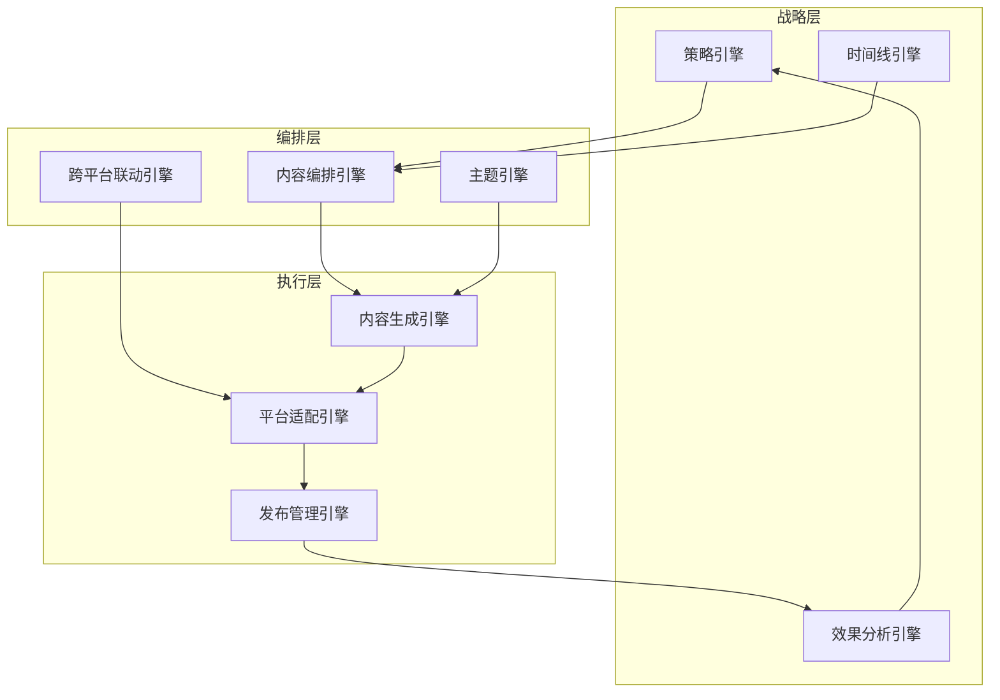

# AIMS 战略性内容编排系统

## 🏀 篮球赛比喻与AIMS核心价值重定义

### 从单点内容生成到战略性内容编排

**单点内容生成工具（如Reply Hunter）**：
```
就像篮球比赛中的单次投篮
- 关注单个动作的完成
- 没有整体战略考量
- 缺乏连贯性和协同效应
```

**AIMS战略性内容编排系统**：
```
就像指挥一场完整的篮球比赛
- 有明确的战略目标
- 多个动作协同配合
- 根据场上情况动态调整
- 贯穿整个时间周期
```

### 篮球赛与内容营销的深度类比

| 篮球赛元素 | 内容营销对应 | AIMS功能 |
|-----------|------------|---------|
| 比赛策略 | 营销策略 | 内容策略制定 |
| 战术体系 | 内容框架 | 内容编排引擎 |
| 球员角色 | 平台特性 | 平台适配系统 |
| 进攻战术 | 内容发布 | 内容分发系统 |
| 防守反击 | 热点响应 | 热点监控系统 |
| 比赛节奏 | 发布节奏 | 时间编排系统 |
| 临场调整 | 策略优化 | 效果分析系统 |
| 球队配合 | 平台协同 | 跨平台联动 |

## 🎯 战略性内容编排的核心理念

### 1. 整体战略思维

**从孤立内容到整体战略**：
```
传统方式：
- 为每个平台单独创建内容
- 平台之间缺乏关联
- 无法形成协同效应

AIMS方式：
- 先制定整体传播策略
- 设计内容主题和核心信息
- 为不同平台分配不同角色
- 确保所有内容形成合力
```

### 2. 时间周期性思考

**从单次发布到持续传播**：
```
传统方式：
- 一次性内容创建和发布
- 缺乏时间维度规划
- 无法形成持续影响

AIMS方式：
- 设计完整传播周期（如产品发布的前中后）
- 规划不同阶段的内容重点
- 设置时间节点和关键里程碑
- 形成持续的传播声量
```

### 3. 平台角色定位

**从平台复制到角色分工**：
```
传统方式：
- 同样内容复制到不同平台
- 忽略平台特性和受众差异
- 效果大打折扣

AIMS方式：
- 为每个平台定义明确角色
- 微博：快速传播、话题引导
- 知乎：深度解析、专业背书
- 小红书：场景展示、情感共鸣
- 视频平台：直观演示、沉浸体验
```

### 4. 内容联动机制

**从独立内容到内容联动**：
```
传统方式：
- 平台间内容相互独立
- 用户体验割裂
- 无法引导用户跨平台

AIMS方式：
- 设计内容间的引导关系
- 微博引流到知乎深度内容
- 知乎专业内容支撑小红书场景
- 形成完整的用户旅程
```

## 🛠️ 战略性内容编排系统架构

### 1. 核心引擎设计



### 1.1 内容编排引擎详细设计

```typescript
class ContentOrchestrationEngine {
  // 核心编排逻辑
  async orchestrateContent(strategy: MarketingStrategy): Promise<ContentMatrix> {
    // 1. 解析营销策略
    const parsedStrategy = this.parseStrategy(strategy);

    // 2. 生成内容主题框架
    const themeFramework = await this.generateThemeFramework(parsedStrategy);

    // 3. 规划平台内容分工
    const platformRoles = this.assignPlatformRoles(parsedStrategy);

    // 4. 设计内容联动关系
    const contentConnections = this.designContentConnections(
      themeFramework,
      platformRoles
    );

    // 5. 生成具体内容
    const contentMatrix = await this.generateContentMatrix(
      themeFramework,
      platformRoles,
      contentConnections
    );

    return contentMatrix;
  }

  // 主题框架生成
  private async generateThemeFramework(strategy: ParsedStrategy): Promise<ThemeFramework> {
    return {
      coreMessage: strategy.keyMessages[0],
      subThemes: strategy.keyMessages.slice(1),
      narrativeArc: this.createNarrativeArc(strategy),
      emotionalTone: this.determineEmotionalTone(strategy),
      contentPillars: this.extractContentPillars(strategy)
    };
  }

  // 平台角色分配
  private assignPlatformRoles(strategy: ParsedStrategy): PlatformRoleMap {
    const roleMap = new Map<string, PlatformRole>();

    // 基于策略目标和平台特性分配角色
    strategy.platforms.forEach(platform => {
      const role = this.determinePlatformRole(platform, strategy.objective);
      roleMap.set(platform, role);
    });

    return roleMap;
  }

  // 内容联动关系设计
  private designContentConnections(
    theme: ThemeFramework,
    roles: PlatformRoleMap
  ): ContentConnectionGraph {
    const connections = new ContentConnectionGraph();

    // 设计内容流动路径
    const flowPaths = this.designFlowPaths(roles);

    // 创建内容引用关系
    const references = this.createContentReferences(theme, roles);

    // 构建用户旅程
    const userJourney = this.buildUserJourney(flowPaths, references);

    connections.addFlowPaths(flowPaths);
    connections.addReferences(references);
    connections.setUserJourney(userJourney);

    return connections;
  }
}
```

### 2. 策略引擎

```typescript
interface MarketingStrategy {
  // 核心策略定义
  objective: MarketingObjective;  // 营销目标
  targetAudience: AudienceSegment[]; // 目标受众
  keyMessages: string[];         // 核心信息
  campaignDuration: {            // 活动周期
    start: Date;
    end: Date;
    phases: CampaignPhase[];     // 活动阶段
  };
  
  // 平台策略
  platformStrategy: {
    [platform: string]: {
      role: PlatformRole;        // 平台角色
      contentTypes: ContentType[]; // 内容类型
      frequency: PublishFrequency; // 发布频率
      kpis: MetricTarget[];      // 关键指标
    }
  };
  
  // 联动策略
  crossPlatformStrategy: {
    flowPatterns: FlowPattern[];  // 流量引导模式
    contentConnections: ContentConnection[]; // 内容关联
    audienceJourney: JourneyStep[]; // 用户旅程
  };
}

// 营销目标类型
enum MarketingObjective {
  BRAND_AWARENESS = '品牌认知',
  PRODUCT_LAUNCH = '产品发布',
  LEAD_GENERATION = '线索获取',
  SALES_CONVERSION = '销售转化',
  CUSTOMER_RETENTION = '客户维系',
  CRISIS_MANAGEMENT = '危机管理'
}

// 平台角色
enum PlatformRole {
  AWARENESS_DRIVER = '认知驱动',
  TRAFFIC_GENERATOR = '流量引导',
  AUTHORITY_BUILDER = '权威建立',
  CONVERSION_CLOSER = '转化促进',
  COMMUNITY_ENGAGER = '社群互动',
  SUPPORT_CHANNEL = '支持渠道'
}
```

### 3. 时间线引擎

```typescript
interface CampaignTimeline {
  // 总体时间线
  campaign: {
    name: string;
    startDate: Date;
    endDate: Date;
    totalDuration: number; // 天数
  };
  
  // 阶段划分
  phases: {
    name: string;        // 阶段名称
    startDate: Date;     // 开始日期
    endDate: Date;       // 结束日期
    objective: string;   // 阶段目标
    keyActivities: string[]; // 关键活动
  }[];
  
  // 关键节点
  milestones: {
    name: string;        // 节点名称
    date: Date;          // 日期
    platforms: string[]; // 相关平台
    contentTypes: string[]; // 内容类型
    importance: 'high' | 'medium' | 'low'; // 重要性
  }[];
  
  // 内容发布计划
  contentSchedule: {
    platform: string;    // 平台
    contentType: string; // 内容类型
    publishDate: Date;   // 发布日期
    publishTime: string; // 发布时间
    theme: string;       // 主题
    status: 'planned' | 'created' | 'approved' | 'published'; // 状态
    dependencies: string[]; // 依赖的其他内容
  }[];
}
```

### 4. 跨平台联动引擎

```typescript
interface CrossPlatformOrchestrator {
  // 内容关联定义
  defineContentConnections(contents: Content[]): ContentConnection[];
  
  // 用户旅程规划
  planUserJourney(strategy: MarketingStrategy): JourneyMap;
  
  // 平台间引导机制
  createCrossPlatformReferences(contents: Content[]): Content[];
  
  // 内容协同效应评估
  evaluateSynergy(contents: Content[]): SynergyScore;
}

// 内容关联类型
interface ContentConnection {
  sourceContent: string; // 源内容ID
  targetContent: string; // 目标内容ID
  connectionType: 'reference' | 'continuation' | 'elaboration' | 'contrast';
  referenceMethod: 'link' | 'mention' | 'quote' | 'implicit';
  expectedFlow: number; // 预期流量
}

// 用户旅程地图
interface JourneyMap {
  entryPoints: {
    platform: string;
    contentType: string;
    audience: string;
  }[];
  
  journeyPaths: {
    steps: {
      platform: string;
      contentType: string;
      action: string;
      nextStep: number; // 下一步索引
    }[];
    conversionPoint: string;
    expectedConversionRate: number;
  }[];
}
```

## 📊 战略性内容编排案例

### 产品发布战略案例

#### 1. 战略定义
```
营销目标：新AI产品发布
目标受众：产品经理、设计师、开发者
核心信息：
- 提升设计效率
- 简化工作流程
- 创新AI技术
活动周期：4周（预热-发布-深化-持续）
```

#### 2. 平台角色定义
```
微博：认知驱动 + 话题引导
- 创建话题讨论
- 发布预告信息
- 实时发布动态

知乎：权威建立 + 专业解析
- 技术原理解析
- 行业趋势分析
- 专家问答互动

小红书：场景展示 + 用户共鸣
- 实际使用场景
- 用户体验分享
- 效果前后对比

B站：直观演示 + 教程分享
- 产品功能演示
- 使用教程
- 创意应用案例
```

#### 3. 时间线规划
```
第1周（预热期）：
- 微博：发布神秘预告，创建话题 #AI改变设计#
- 知乎：发布行业趋势文章《AI设计工具的未来》
- 小红书：分享设计师工作痛点

第2周（发布期）：
- 全平台：产品正式发布信息
- 微博：邀请KOL体验并分享
- 知乎：技术原理深度解析
- 小红书：首批用户体验分享
- B站：产品功能完整演示

第3周（深化期）：
- 微博：用户反馈和数据分享
- 知乎：与竞品对比分析
- 小红书：不同场景应用案例
- B站：进阶使用教程

第4周（持续期）：
- 微博：用户成功案例
- 知乎：行业应用前景讨论
- 小红书：创意使用技巧
- B站：用户作品展示
```

#### 4. 内容联动设计
```
微博 → 知乎：
- 微博话题讨论引发问题
- 知乎提供深度解答
- 微博引用知乎专业内容

知乎 → 小红书：
- 知乎理论支持小红书实践
- 小红书场景验证知乎观点
- 形成理论+实践闭环

小红书 → B站：
- 小红书展示效果
- B站提供实现教程
- 相互引用增强可信度

B站 → 微博：
- B站教程激发讨论
- 微博分享学习心得
- 形成完整闭环
```

## 🔄 与传统内容生成的对比

### 1. 战略深度对比

| 维度 | 传统内容生成 | AIMS战略编排 |
|-----|------------|------------|
| 思考维度 | 单平台、单内容 | 多平台、整体战略 |
| 时间跨度 | 一次性发布 | 完整传播周期 |
| 内容关联 | 相互独立 | 有机联动 |
| 效果评估 | 单点指标 | 整体协同效应 |

### 2. 用户体验对比

| 用户旅程 | 传统内容生成 | AIMS战略编排 |
|---------|------------|------------|
| 初次接触 | 随机、分散 | 策略性引导 |
| 深度了解 | 需用户主动寻找 | 平台间自然引导 |
| 决策过程 | 信息碎片化 | 完整信息闭环 |
| 转化路径 | 不明确 | 清晰设计 |

### 3. 效果对比

| 效果指标 | 传统内容生成 | AIMS战略编排 |
|---------|------------|------------|
| 覆盖广度 | 有限（单平台） | 广泛（多平台） |
| 传播深度 | 浅层传播 | 深度渗透 |
| 用户参与 | 被动接收 | 主动参与 |
| 转化效率 | 低（单点努力） | 高（协同效应） |
| 资源利用 | 低效（重复工作） | 高效（一次策划多平台执行） |

## 🚀 AIMS系统实现路径

### 1. 核心功能模块

```
1. 策略引擎
   - 营销目标定义
   - 受众分析
   - 平台角色规划
   - 核心信息提取

2. 时间线引擎
   - 传播周期规划
   - 阶段划分
   - 关键节点设置
   - 发布计划生成

3. 内容编排引擎
   - 主题一致性管理
   - 跨平台内容关联
   - 用户旅程设计
   - 内容依赖管理

4. 内容生成引擎
   - 平台特性适配
   - 品牌声音一致性
   - 内容变体生成
   - 内容质量控制

5. 效果分析引擎
   - 跨平台数据整合
   - 用户旅程追踪
   - 协同效应评估
   - 策略优化建议
```

### 2. 用户界面设计

```
1. 战略规划视图
   - 营销目标设置
   - 受众定义
   - 平台角色分配
   - 核心信息提取

2. 时间线视图
   - 甘特图式传播周期
   - 阶段和里程碑
   - 内容发布计划
   - 依赖关系可视化

3. 内容编排视图
   - 跨平台内容关联图
   - 用户旅程地图
   - 内容流动可视化
   - 协同效应预测

4. 内容工作区
   - 平台分组视图
   - 内容创建和编辑
   - 跨平台预览
   - 一键多平台发布

5. 分析仪表板
   - 跨平台效果对比
   - 用户旅程漏斗
   - 协同效应评估
   - 优化建议
```

### 3. 实现路径

#### Phase 1: 基础编排系统（3个月）
```
- 策略模板库
- 基础时间线规划
- 简单平台角色定义
- 品牌声音学习
- 多平台内容生成
```

#### Phase 2: 高级编排功能（3个月）
```
- 内容关联管理
- 用户旅程设计
- 跨平台引导机制
- 内容依赖管理
- 效果预测模型
```

#### Phase 3: 智能优化系统（4个月）
```
- 协同效应评估
- 自动优化建议
- 高级数据分析
- A/B测试系统
- 机器学习优化
```

## 💡 结论

AIMS不是简单的内容生成工具，而是真正的**战略性内容编排系统**。它就像篮球教练，不只关注单个投篮动作，而是设计整场比赛的战术体系，协调各个球员的配合，根据比赛进程动态调整策略，最终赢得整场比赛。

通过战略性内容编排，AIMS帮助品牌实现：
1. 跨平台一致的品牌声音
2. 有机联动的内容矩阵
3. 清晰设计的用户旅程
4. 持续有效的传播周期
5. 资源高效的营销策略

这种战略性思维是AIMS与简单内容生成工具的根本区别，也是其核心竞争力所在。
