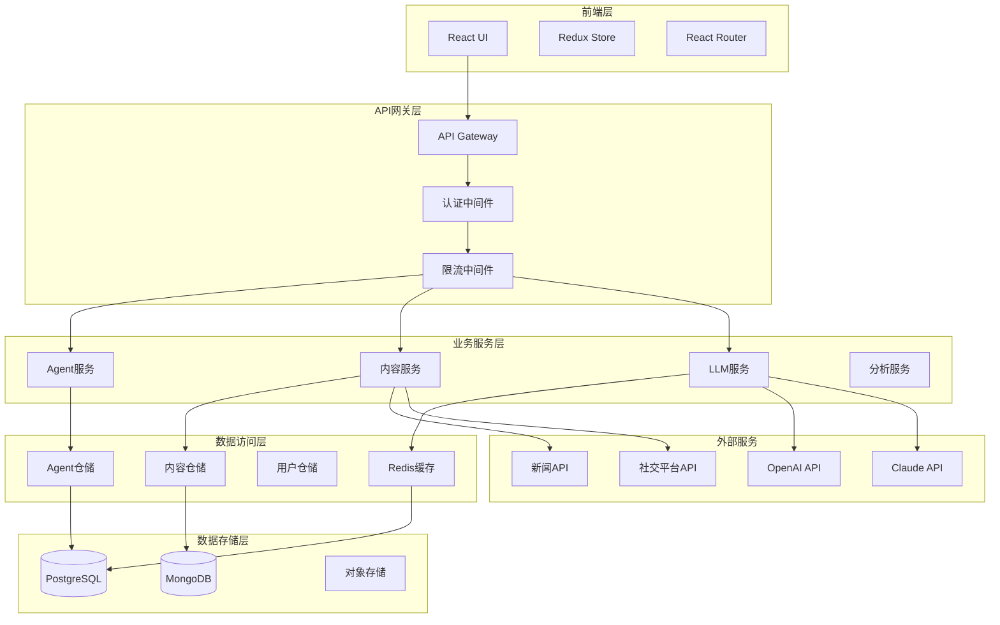

# AIMS 技术规格说明

## 🏗️ 系统架构

### 1. 整体架构图



### 2. 微服务架构

#### 服务划分
| 服务名称 | 职责 | 技术栈 | 端口 |
|---------|------|--------|------|
| Frontend Service | 用户界面 | React + TypeScript | 3000 |
| API Gateway | 请求路由、认证、限流 | Express + TypeScript | 3001 |
| Agent Service | Agent管理和协作 | Node.js + TypeScript | 3002 |
| Content Service | 内容生成和管理 | Node.js + TypeScript | 3003 |
| LLM Service | LLM提供商集成 | Python + FastAPI | 3004 |
| Analytics Service | 数据分析和监控 | Node.js + TypeScript | 3005 |
| Notification Service | 通知和消息 | Node.js + TypeScript | 3006 |

#### 服务间通信
```typescript
// 服务间通信接口定义
interface ServiceCommunication {
  // 同步通信 - HTTP/REST
  http: {
    method: 'GET' | 'POST' | 'PUT' | 'DELETE';
    endpoint: string;
    headers: Record<string, string>;
    body?: any;
  };
  
  // 异步通信 - 消息队列
  messageQueue: {
    exchange: string;
    routingKey: string;
    message: any;
    options?: {
      persistent: boolean;
      priority: number;
    };
  };
  
  // 事件驱动 - EventBus
  events: {
    eventType: string;
    payload: any;
    metadata: {
      timestamp: Date;
      source: string;
      correlationId: string;
    };
  };
}
```

## 🛠️ 技术栈选择

### 1. 前端技术栈

#### 核心框架
```json
{
  "framework": "React 18.3.1",
  "language": "TypeScript 5.5.3",
  "buildTool": "Vite 5.4.2",
  "stateManagement": "Redux Toolkit 2.0.0",
  "routing": "React Router 6.x",
  "styling": "Tailwind CSS 3.4.1",
  "uiComponents": "Headless UI + Lucide React",
  "testing": "Jest + React Testing Library + Playwright"
}
```

#### 开发工具
```json
{
  "linting": "ESLint 9.9.1",
  "formatting": "Prettier 3.0.0",
  "typeChecking": "TypeScript Compiler",
  "bundleAnalysis": "Vite Bundle Analyzer",
  "storybook": "Storybook 7.x"
}
```

### 2. 后端技术栈

#### 核心技术
```json
{
  "runtime": "Node.js 20.x",
  "framework": "Express 4.18.0",
  "language": "TypeScript 5.5.3",
  "database": {
    "primary": "PostgreSQL 15.x",
    "document": "MongoDB 7.x",
    "cache": "Redis 7.x"
  },
  "orm": "Prisma 5.0.0",
  "authentication": "JWT + Passport.js",
  "validation": "Joi 17.11.0",
  "logging": "Winston 3.11.0"
}
```

#### 外部集成
```json
{
  "llmProviders": [
    "OpenAI GPT-4",
    "Anthropic Claude",
    "Google Gemini",
    "Local Ollama"
  ],
  "messageQueue": "RabbitMQ 3.12.x",
  "monitoring": "Prometheus + Grafana",
  "tracing": "Jaeger",
  "containerization": "Docker + Kubernetes"
}
```

### 3. AI/ML技术栈

#### LLM集成
```python
# Python LLM服务技术栈
{
  "framework": "FastAPI 0.104.0",
  "llmLibrary": "LangChain 0.1.0",
  "vectorDatabase": "Pinecone / Weaviate",
  "embeddingModel": "OpenAI text-embedding-ada-002",
  "promptEngineering": "LangChain PromptTemplate",
  "memoryManagement": "LangChain Memory",
  "agentFramework": "LangChain Agents"
}
```

## 📡 API接口规范

### 1. RESTful API设计

#### 基础规范
```typescript
// API响应格式标准
interface APIResponse<T> {
  success: boolean;
  data?: T;
  error?: {
    code: string;
    message: string;
    details?: any;
  };
  meta?: {
    timestamp: string;
    requestId: string;
    version: string;
  };
  pagination?: {
    page: number;
    limit: number;
    total: number;
    totalPages: number;
  };
}

// 成功响应示例
{
  "success": true,
  "data": {
    "id": "agent-123",
    "name": "CMO Agent",
    "status": "active"
  },
  "meta": {
    "timestamp": "2024-01-15T10:30:00Z",
    "requestId": "req-456",
    "version": "1.0.0"
  }
}

// 错误响应示例
{
  "success": false,
  "error": {
    "code": "AGENT_NOT_FOUND",
    "message": "Agent with ID 'agent-123' not found",
    "details": {
      "agentId": "agent-123",
      "searchedAt": "2024-01-15T10:30:00Z"
    }
  },
  "meta": {
    "timestamp": "2024-01-15T10:30:00Z",
    "requestId": "req-456",
    "version": "1.0.0"
  }
}
```

#### URL设计规范
```
# 资源命名规范
GET    /api/v1/agents                    # 获取Agent列表
POST   /api/v1/agents                    # 创建Agent
GET    /api/v1/agents/{id}               # 获取特定Agent
PUT    /api/v1/agents/{id}               # 更新Agent
DELETE /api/v1/agents/{id}               # 删除Agent

# 嵌套资源
GET    /api/v1/agents/{id}/tasks         # 获取Agent的任务列表
POST   /api/v1/agents/{id}/tasks         # 为Agent创建任务
GET    /api/v1/agents/{id}/tasks/{taskId} # 获取特定任务

# 查询参数
GET    /api/v1/agents?status=active&type=cmo&page=1&limit=20
GET    /api/v1/content?platform=weibo&created_after=2024-01-01
```

### 2. Agent管理API

#### Agent CRUD操作
```typescript
// GET /api/v1/agents
interface GetAgentsRequest {
  page?: number;
  limit?: number;
  status?: 'active' | 'inactive' | 'error';
  type?: 'cmo' | 'intelligence' | 'platform';
  search?: string;
}

interface GetAgentsResponse {
  agents: Agent[];
  pagination: PaginationInfo;
}

// POST /api/v1/agents
interface CreateAgentRequest {
  name: string;
  type: AgentType;
  description?: string;
  config: AgentConfig;
  capabilities: string[];
}

interface CreateAgentResponse {
  agent: Agent;
}

// PUT /api/v1/agents/{id}
interface UpdateAgentRequest {
  name?: string;
  description?: string;
  config?: Partial<AgentConfig>;
  capabilities?: string[];
  status?: AgentStatus;
}

// Agent任务管理
// POST /api/v1/agents/{id}/tasks
interface AssignTaskRequest {
  type: TaskType;
  priority: 'low' | 'medium' | 'high' | 'urgent';
  context: Record<string, any>;
  deadline?: string;
}

interface AssignTaskResponse {
  task: AgentTask;
  estimatedCompletion: string;
}
```

### 3. 内容生成API

#### 内容生成接口
```typescript
// POST /api/v1/content/generate
interface GenerateContentRequest {
  topic: string;
  platforms: ContentPlatform[];
  tone?: 'professional' | 'casual' | 'humorous' | 'authoritative';
  targetAudience?: string;
  keywords?: string[];
  constraints?: {
    maxLength?: number;
    includeHashtags?: boolean;
    includeEmojis?: boolean;
  };
  agentId?: string; // 指定特定Agent
}

interface GenerateContentResponse {
  contents: {
    platform: ContentPlatform;
    content: string;
    metadata: {
      wordCount: number;
      estimatedReadTime: number;
      sentiment: number;
      keywords: string[];
    };
  }[];
  generationTime: number;
  cost: number;
}

// GET /api/v1/content
interface GetContentRequest {
  page?: number;
  limit?: number;
  platform?: ContentPlatform;
  status?: 'draft' | 'approved' | 'published' | 'rejected';
  agentId?: string;
  createdAfter?: string;
  createdBefore?: string;
}

// POST /api/v1/content/{id}/review
interface ReviewContentRequest {
  action: 'approve' | 'reject' | 'request_changes';
  feedback?: string;
  suggestions?: string[];
}
```

### 4. LLM服务API

#### LLM提供商管理
```typescript
// GET /api/v1/llm/providers
interface GetProvidersResponse {
  providers: {
    id: string;
    name: string;
    status: 'active' | 'inactive' | 'error';
    models: string[];
    costPerToken: number;
    rateLimit: {
      requestsPerMinute: number;
      tokensPerMinute: number;
    };
  }[];
}

// POST /api/v1/llm/generate
interface LLMGenerateRequest {
  prompt: string;
  model?: string;
  provider?: string;
  parameters?: {
    temperature?: number;
    maxTokens?: number;
    topP?: number;
    frequencyPenalty?: number;
  };
  systemPrompt?: string;
}

interface LLMGenerateResponse {
  content: string;
  usage: {
    promptTokens: number;
    completionTokens: number;
    totalTokens: number;
  };
  model: string;
  provider: string;
  cost: number;
  responseTime: number;
}
```

## 🗄️ 数据库设计

### 1. PostgreSQL主数据库

#### 核心表结构
```sql
-- 用户表
CREATE TABLE users (
    id UUID PRIMARY KEY DEFAULT gen_random_uuid(),
    email VARCHAR(255) UNIQUE NOT NULL,
    password_hash VARCHAR(255) NOT NULL,
    name VARCHAR(100) NOT NULL,
    role VARCHAR(50) NOT NULL DEFAULT 'user',
    status VARCHAR(20) NOT NULL DEFAULT 'active',
    created_at TIMESTAMP WITH TIME ZONE DEFAULT NOW(),
    updated_at TIMESTAMP WITH TIME ZONE DEFAULT NOW()
);

-- Agent表
CREATE TABLE agents (
    id UUID PRIMARY KEY DEFAULT gen_random_uuid(),
    name VARCHAR(100) NOT NULL,
    type VARCHAR(50) NOT NULL,
    description TEXT,
    config JSONB NOT NULL,
    capabilities TEXT[] NOT NULL,
    status VARCHAR(20) NOT NULL DEFAULT 'idle',
    created_by UUID REFERENCES users(id),
    created_at TIMESTAMP WITH TIME ZONE DEFAULT NOW(),
    updated_at TIMESTAMP WITH TIME ZONE DEFAULT NOW()
);

-- Agent任务表
CREATE TABLE agent_tasks (
    id UUID PRIMARY KEY DEFAULT gen_random_uuid(),
    agent_id UUID REFERENCES agents(id) ON DELETE CASCADE,
    type VARCHAR(50) NOT NULL,
    priority VARCHAR(20) NOT NULL DEFAULT 'medium',
    status VARCHAR(20) NOT NULL DEFAULT 'pending',
    context JSONB NOT NULL,
    result JSONB,
    error_message TEXT,
    deadline TIMESTAMP WITH TIME ZONE,
    started_at TIMESTAMP WITH TIME ZONE,
    completed_at TIMESTAMP WITH TIME ZONE,
    created_at TIMESTAMP WITH TIME ZONE DEFAULT NOW()
);

-- 内容表
CREATE TABLE contents (
    id UUID PRIMARY KEY DEFAULT gen_random_uuid(),
    title VARCHAR(200),
    content TEXT NOT NULL,
    platform VARCHAR(50) NOT NULL,
    status VARCHAR(20) NOT NULL DEFAULT 'draft',
    metadata JSONB,
    agent_id UUID REFERENCES agents(id),
    created_by UUID REFERENCES users(id),
    reviewed_by UUID REFERENCES users(id),
    published_at TIMESTAMP WITH TIME ZONE,
    created_at TIMESTAMP WITH TIME ZONE DEFAULT NOW(),
    updated_at TIMESTAMP WITH TIME ZONE DEFAULT NOW()
);

-- LLM使用记录表
CREATE TABLE llm_usage (
    id UUID PRIMARY KEY DEFAULT gen_random_uuid(),
    provider VARCHAR(50) NOT NULL,
    model VARCHAR(100) NOT NULL,
    prompt_tokens INTEGER NOT NULL,
    completion_tokens INTEGER NOT NULL,
    total_tokens INTEGER NOT NULL,
    cost DECIMAL(10, 6) NOT NULL,
    response_time INTEGER NOT NULL, -- 毫秒
    agent_id UUID REFERENCES agents(id),
    task_id UUID REFERENCES agent_tasks(id),
    created_at TIMESTAMP WITH TIME ZONE DEFAULT NOW()
);
```

#### 索引优化
```sql
-- 性能优化索引
CREATE INDEX idx_agents_type_status ON agents(type, status);
CREATE INDEX idx_agent_tasks_agent_id_status ON agent_tasks(agent_id, status);
CREATE INDEX idx_agent_tasks_created_at ON agent_tasks(created_at DESC);
CREATE INDEX idx_contents_platform_status ON contents(platform, status);
CREATE INDEX idx_contents_created_at ON contents(created_at DESC);
CREATE INDEX idx_llm_usage_created_at ON llm_usage(created_at DESC);
CREATE INDEX idx_llm_usage_agent_id ON llm_usage(agent_id);

-- JSONB字段索引
CREATE INDEX idx_agents_config_gin ON agents USING GIN(config);
CREATE INDEX idx_agent_tasks_context_gin ON agent_tasks USING GIN(context);
CREATE INDEX idx_contents_metadata_gin ON contents USING GIN(metadata);
```

### 2. MongoDB文档数据库

#### 集合设计
```javascript
// 内容生成历史集合
db.content_generations.createIndex({
  "agentId": 1,
  "createdAt": -1
});

// 文档结构
{
  "_id": ObjectId("..."),
  "agentId": "agent-123",
  "topic": "AI技术发展趋势",
  "platforms": ["weibo", "xiaohongshu"],
  "generatedContent": {
    "weibo": {
      "content": "AI技术正在快速发展...",
      "metadata": {
        "wordCount": 135,
        "sentiment": 0.8,
        "keywords": ["AI", "技术", "发展"]
      }
    },
    "xiaohongshu": {
      "content": "分享一下最近对AI技术的观察...",
      "metadata": {
        "wordCount": 856,
        "sentiment": 0.7,
        "keywords": ["AI", "观察", "分享"]
      }
    }
  },
  "generationParams": {
    "temperature": 0.7,
    "maxTokens": 1000,
    "model": "gpt-4"
  },
  "performance": {
    "generationTime": 2.5,
    "cost": 0.05,
    "tokensUsed": 1250
  },
  "createdAt": ISODate("2024-01-15T10:30:00Z"),
  "updatedAt": ISODate("2024-01-15T10:30:00Z")
}

// 市场情报数据集合
db.market_intelligence.createIndex({
  "source": 1,
  "timestamp": -1,
  "relevanceScore": -1
});

// 文档结构
{
  "_id": ObjectId("..."),
  "source": "twitter",
  "originalUrl": "https://twitter.com/...",
  "title": "AI创业公司获得新一轮融资",
  "content": "据报道，AI创业公司XYZ获得了...",
  "author": {
    "name": "Tech Reporter",
    "followers": 50000,
    "verified": true
  },
  "metrics": {
    "likes": 1250,
    "shares": 340,
    "comments": 89,
    "views": 15000
  },
  "analysis": {
    "sentiment": 0.8,
    "relevanceScore": 0.92,
    "keywords": ["AI", "创业", "融资"],
    "topics": ["artificial-intelligence", "startup", "funding"],
    "trendingScore": 85
  },
  "timestamp": ISODate("2024-01-15T08:45:00Z"),
  "processedAt": ISODate("2024-01-15T08:47:00Z")
}
```

### 3. Redis缓存设计

#### 缓存策略
```typescript
// 缓存键命名规范
interface CacheKeys {
  // Agent相关缓存
  agent: `agent:${string}`;                    // agent:agent-123
  agentList: `agents:${string}:${string}`;     // agents:active:cmo
  agentTasks: `agent:${string}:tasks`;         // agent:agent-123:tasks
  
  // 内容相关缓存
  content: `content:${string}`;                // content:content-456
  contentList: `contents:${string}:${number}:${number}`; // contents:weibo:1:20
  
  // LLM相关缓存
  llmResponse: `llm:${string}`;                // llm:hash-of-prompt
  llmProviders: 'llm:providers';
  llmUsage: `llm:usage:${string}:${string}`;   // llm:usage:2024-01:agent-123
  
  // 用户会话缓存
  userSession: `session:${string}`;            // session:user-789
  userPermissions: `permissions:${string}`;    // permissions:user-789
}

// 缓存配置
const cacheConfig = {
  // 短期缓存 (5分钟)
  shortTerm: {
    ttl: 300,
    keys: ['agentTasks', 'contentList']
  },
  
  // 中期缓存 (1小时)
  mediumTerm: {
    ttl: 3600,
    keys: ['agent', 'content', 'llmProviders']
  },
  
  // 长期缓存 (24小时)
  longTerm: {
    ttl: 86400,
    keys: ['llmResponse', 'userPermissions']
  }
};
```

## 🔐 安全规范

### 1. 认证授权

#### JWT令牌设计
```typescript
interface JWTPayload {
  sub: string;        // 用户ID
  email: string;      // 用户邮箱
  role: string;       // 用户角色
  permissions: string[]; // 权限列表
  iat: number;        // 签发时间
  exp: number;        // 过期时间
  jti: string;        // 令牌ID
}

// 权限定义
enum Permission {
  // Agent权限
  AGENT_CREATE = 'agent:create',
  AGENT_READ = 'agent:read',
  AGENT_UPDATE = 'agent:update',
  AGENT_DELETE = 'agent:delete',
  
  // 内容权限
  CONTENT_CREATE = 'content:create',
  CONTENT_READ = 'content:read',
  CONTENT_UPDATE = 'content:update',
  CONTENT_DELETE = 'content:delete',
  CONTENT_PUBLISH = 'content:publish',
  
  // 系统权限
  SYSTEM_ADMIN = 'system:admin',
  SYSTEM_MONITOR = 'system:monitor'
}
```

#### 角色权限矩阵
| 角色 | Agent管理 | 内容创建 | 内容审核 | 内容发布 | 系统管理 |
|-----|----------|---------|---------|---------|---------|
| 管理员 | ✅ | ✅ | ✅ | ✅ | ✅ |
| 编辑 | ❌ | ✅ | ✅ | ✅ | ❌ |
| 作者 | ❌ | ✅ | ❌ | ❌ | ❌ |
| 查看者 | ❌ | ❌ | ❌ | ❌ | ❌ |

### 2. 数据保护

#### 敏感数据加密
```typescript
// API密钥加密存储
class SecureStorage {
  private static readonly ENCRYPTION_KEY = process.env.ENCRYPTION_KEY!;
  
  static encrypt(data: string): string {
    const cipher = crypto.createCipher('aes-256-cbc', this.ENCRYPTION_KEY);
    let encrypted = cipher.update(data, 'utf8', 'hex');
    encrypted += cipher.final('hex');
    return encrypted;
  }
  
  static decrypt(encryptedData: string): string {
    const decipher = crypto.createDecipher('aes-256-cbc', this.ENCRYPTION_KEY);
    let decrypted = decipher.update(encryptedData, 'hex', 'utf8');
    decrypted += decipher.final('utf8');
    return decrypted;
  }
}
```

#### 输入验证
```typescript
// 输入验证模式
const agentConfigSchema = Joi.object({
  name: Joi.string().min(1).max(100).required(),
  type: Joi.string().valid('cmo', 'intelligence', 'platform').required(),
  description: Joi.string().max(500).optional(),
  capabilities: Joi.array().items(Joi.string()).min(1).required(),
  config: Joi.object({
    temperature: Joi.number().min(0).max(2).default(0.7),
    maxTokens: Joi.number().min(1).max(4000).default(1000),
    systemPrompt: Joi.string().max(2000).optional()
  }).required()
});
```

## 📊 监控和日志

### 1. 应用监控

#### 关键指标
```typescript
interface SystemMetrics {
  // 性能指标
  performance: {
    responseTime: number;      // 平均响应时间
    throughput: number;        // 每秒请求数
    errorRate: number;         // 错误率
    availability: number;      // 可用性
  };

  // 业务指标
  business: {
    activeAgents: number;      // 活跃Agent数量
    contentGenerated: number;  // 生成内容数量
    llmApiCalls: number;      // LLM API调用次数
    userSessions: number;      // 用户会话数
  };

  // 资源指标
  resources: {
    cpuUsage: number;         // CPU使用率
    memoryUsage: number;      // 内存使用率
    diskUsage: number;        // 磁盘使用率
    networkIO: number;        // 网络IO
  };
}
```

#### 告警规则
```yaml
# Prometheus告警规则
groups:
  - name: aims-alerts
    rules:
      - alert: HighErrorRate
        expr: rate(http_requests_total{status=~"5.."}[5m]) > 0.1
        for: 2m
        labels:
          severity: critical
        annotations:
          summary: "High error rate detected"

      - alert: AgentDown
        expr: up{job="agent-service"} == 0
        for: 1m
        labels:
          severity: critical
        annotations:
          summary: "Agent service is down"

      - alert: LLMCostSpike
        expr: increase(llm_cost_total[1h]) > 100
        for: 5m
        labels:
          severity: warning
        annotations:
          summary: "LLM costs are spiking"
```

### 2. 日志规范

#### 日志级别和格式
```typescript
// 日志配置
const loggerConfig = {
  level: process.env.LOG_LEVEL || 'info',
  format: winston.format.combine(
    winston.format.timestamp(),
    winston.format.errors({ stack: true }),
    winston.format.json()
  ),
  transports: [
    new winston.transports.Console(),
    new winston.transports.File({ filename: 'logs/error.log', level: 'error' }),
    new winston.transports.File({ filename: 'logs/combined.log' })
  ]
};

// 结构化日志格式
interface LogEntry {
  timestamp: string;
  level: 'error' | 'warn' | 'info' | 'debug';
  message: string;
  service: string;
  traceId?: string;
  userId?: string;
  agentId?: string;
  metadata?: Record<string, any>;
  error?: {
    name: string;
    message: string;
    stack: string;
  };
}
```

#### 链路追踪
```typescript
// 分布式追踪配置
import { trace, context, SpanStatusCode } from '@opentelemetry/api';

class TracingService {
  static createSpan(name: string, attributes?: Record<string, any>) {
    const tracer = trace.getTracer('aims-service');
    const span = tracer.startSpan(name, {
      attributes: {
        service: 'aims',
        version: process.env.APP_VERSION,
        ...attributes
      }
    });
    return span;
  }

  static async executeWithSpan<T>(
    name: string,
    fn: () => Promise<T>,
    attributes?: Record<string, any>
  ): Promise<T> {
    const span = this.createSpan(name, attributes);

    try {
      const result = await fn();
      span.setStatus({ code: SpanStatusCode.OK });
      return result;
    } catch (error) {
      span.setStatus({
        code: SpanStatusCode.ERROR,
        message: error.message
      });
      throw error;
    } finally {
      span.end();
    }
  }
}
```

## 🚀 性能优化

### 1. 前端性能优化

#### 代码分割和懒加载
```typescript
// 路由级代码分割
const Dashboard = lazy(() => import('./pages/Dashboard'));
const AgentManagement = lazy(() => import('./pages/AgentManagement'));

// 组件级代码分割
const HeavyChart = lazy(() => import('./components/HeavyChart'));

// 预加载关键路由
const preloadRoutes = () => {
  import('./pages/Dashboard');
  import('./pages/AgentManagement');
};

// 资源预加载
<link rel="preload" href="/api/agents" as="fetch" crossorigin="anonymous" />
```

#### 缓存策略
```typescript
// Service Worker缓存策略
const cacheStrategy = {
  // 静态资源 - 缓存优先
  static: {
    pattern: /\.(js|css|png|jpg|svg)$/,
    strategy: 'CacheFirst',
    cacheName: 'static-cache',
    expiration: {
      maxEntries: 100,
      maxAgeSeconds: 30 * 24 * 60 * 60 // 30天
    }
  },

  // API数据 - 网络优先
  api: {
    pattern: /\/api\//,
    strategy: 'NetworkFirst',
    cacheName: 'api-cache',
    expiration: {
      maxEntries: 50,
      maxAgeSeconds: 5 * 60 // 5分钟
    }
  }
};
```

### 2. 后端性能优化

#### 数据库查询优化
```sql
-- 查询优化示例
-- 使用索引优化的查询
EXPLAIN (ANALYZE, BUFFERS)
SELECT a.*, COUNT(t.id) as task_count
FROM agents a
LEFT JOIN agent_tasks t ON a.id = t.agent_id AND t.status = 'pending'
WHERE a.status = 'active' AND a.type = 'cmo'
GROUP BY a.id
ORDER BY a.created_at DESC
LIMIT 20;

-- 分页查询优化
SELECT * FROM contents
WHERE created_at < $1
ORDER BY created_at DESC
LIMIT 20;
```

#### 缓存层优化
```typescript
// 多级缓存策略
class CacheManager {
  private l1Cache = new Map(); // 内存缓存
  private l2Cache: Redis;      // Redis缓存

  async get<T>(key: string): Promise<T | null> {
    // L1缓存查找
    if (this.l1Cache.has(key)) {
      return this.l1Cache.get(key);
    }

    // L2缓存查找
    const cached = await this.l2Cache.get(key);
    if (cached) {
      const data = JSON.parse(cached);
      this.l1Cache.set(key, data);
      return data;
    }

    return null;
  }

  async set<T>(key: string, value: T, ttl: number): Promise<void> {
    // 写入L1缓存
    this.l1Cache.set(key, value);

    // 写入L2缓存
    await this.l2Cache.setex(key, ttl, JSON.stringify(value));
  }
}
```

## 🔧 配置管理

### 1. 环境配置

#### 配置文件结构
```typescript
// config/index.ts
interface AppConfig {
  app: {
    name: string;
    version: string;
    port: number;
    env: 'development' | 'staging' | 'production';
  };

  database: {
    postgres: {
      host: string;
      port: number;
      database: string;
      username: string;
      password: string;
      ssl: boolean;
    };
    mongodb: {
      uri: string;
      database: string;
    };
    redis: {
      host: string;
      port: number;
      password?: string;
    };
  };

  llm: {
    providers: {
      openai: {
        apiKey: string;
        baseURL: string;
        defaultModel: string;
      };
      claude: {
        apiKey: string;
        baseURL: string;
        defaultModel: string;
      };
    };
    costLimits: {
      daily: number;
      monthly: number;
    };
  };

  security: {
    jwtSecret: string;
    encryptionKey: string;
    corsOrigins: string[];
  };

  monitoring: {
    prometheus: {
      enabled: boolean;
      port: number;
    };
    jaeger: {
      endpoint: string;
      serviceName: string;
    };
  };
}

// 配置加载
export const config: AppConfig = {
  app: {
    name: process.env.APP_NAME || 'AIMS',
    version: process.env.APP_VERSION || '1.0.0',
    port: parseInt(process.env.PORT || '3000'),
    env: (process.env.NODE_ENV as any) || 'development'
  },
  // ... 其他配置
};
```

### 2. 配置验证

#### 环境变量验证
```typescript
import Joi from 'joi';

const configSchema = Joi.object({
  NODE_ENV: Joi.string().valid('development', 'staging', 'production').required(),
  PORT: Joi.number().port().default(3000),

  // 数据库配置
  DATABASE_URL: Joi.string().uri().required(),
  MONGODB_URI: Joi.string().uri().required(),
  REDIS_URL: Joi.string().uri().required(),

  // LLM配置
  OPENAI_API_KEY: Joi.string().required(),
  CLAUDE_API_KEY: Joi.string().required(),

  // 安全配置
  JWT_SECRET: Joi.string().min(32).required(),
  ENCRYPTION_KEY: Joi.string().min(32).required(),

  // 监控配置
  PROMETHEUS_ENABLED: Joi.boolean().default(true),
  JAEGER_ENDPOINT: Joi.string().uri().optional()
});

// 配置验证
const { error, value } = configSchema.validate(process.env);
if (error) {
  throw new Error(`Configuration validation error: ${error.message}`);
}
```
