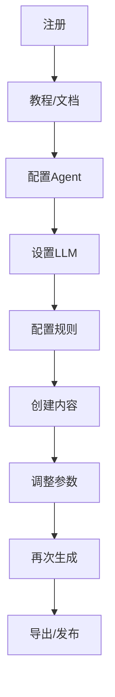
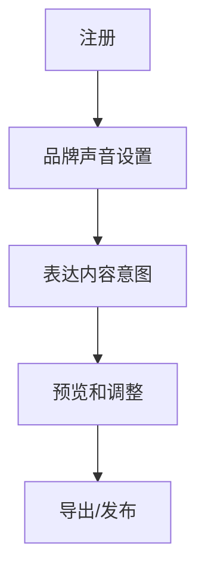
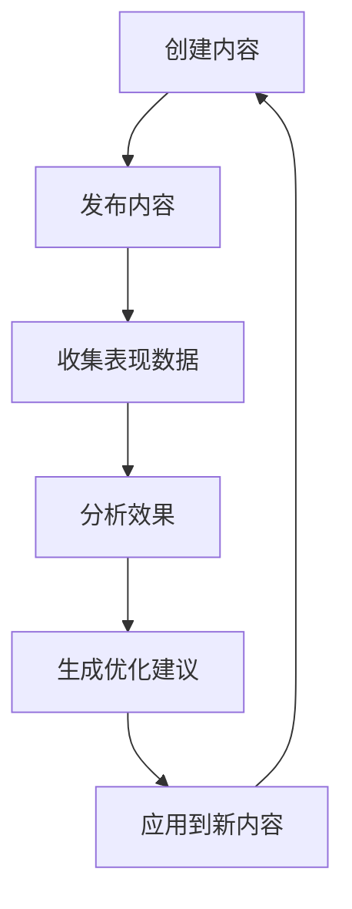

# AIMS 用户体验设计

## 🎯 用户体验设计原则

### 1. 战略思维，而非工具操作

**从"内容创作"到"战略编排"的转变**

```
传统工具方式（操作驱动）：
1. 选择内容类型和模板
2. 配置生成参数
3. 逐个平台创建内容
4. 手动调整平台适配
5. 分别发布和管理

AIMS方式（战略驱动）：
1. 用户表达营销策略意图
   "我们要发布新AI产品，4周内建立行业权威地位，主要受众是产品经理"
2. 系统制定完整传播战役
3. 用户确认平台角色分工和内容联动
4. 启动协同传播执行
```

### 2. 渐进式功能解锁

**从"复杂界面"到"成长型产品"**

```
传统方式（全量功能）：
- 首次使用即展示所有功能
- 复杂界面吓退新用户
- 高学习成本

AIMS方式（渐进式解锁）：
- 初始只展示核心功能
- 随使用逐步解锁高级功能
- 根据用户成熟度推荐新功能
```

### 3. 对话式交互

**从"填表格"到"对话"**

```
传统方式（表单填写）：
- 填写多个表单字段
- 点击多个按钮和选项
- 在多个页面间跳转

AIMS方式（对话交互）：
- 与AI助手自然对话
- AI理解意图并执行
- 上下文感知，记住偏好
```

### 4. 即时反馈

**从"等待结果"到"实时预览"**

```
传统方式（批处理）：
- 配置所有参数
- 点击生成按钮
- 等待最终结果

AIMS方式（即时反馈）：
- 输入意图时实时提示
- 生成过程可视化
- 结果即时预览和调整
```

## 🚶 简化用户旅程

### 1. 新用户旅程

#### 传统方式（多步骤）


#### AIMS方式（简化流程）


### 2. 品牌声音设置流程

#### 传统方式（复杂配置）
```
1. 填写品牌名称和描述
2. 选择行业和目标受众
3. 配置语调参数（专业度、友好度等）
4. 设置词汇偏好和禁用词
5. 配置句式和段落结构
6. 设置品牌人格特征
7. 测试并调整参数
```

#### AIMS方式（示例学习）
```
1. 上传3-5篇现有内容（拖放或选择文件）
2. AI自动分析并提取品牌声音特征
3. 用户确认或简单调整提取结果
4. 完成设置，立即可用
```

### 3. 内容创建流程

#### 传统方式（多步骤配置）
```
1. 选择内容类型和平台
2. 设置主题和关键词
3. 配置内容长度和格式
4. 设置风格和语调参数
5. 点击生成按钮
6. 等待生成完成
7. 审核和编辑内容
8. 调整参数重新生成
9. 最终确认并导出
```

#### AIMS方式（意图驱动）
```
1. 输入内容意图
   "为我们的新AI产品创建一周的社媒内容，风格专业但友好，
    重点强调易用性和创新性，覆盖微博、知乎和小红书"
2. AI理解意图并生成多平台内容
3. 用户预览和编辑（如需）
4. 确认并导出/发布
```

## 🎨 界面设计概念

### 1. 主界面设计

#### 意图输入界面
```
┌────────────────────────────────────────────────┐
│                                                │
│  🔍 我想要...                                   │
│  ┌──────────────────────────────────────────┐  │
│  │ 为我们的新AI产品创建一周的社媒内容，风格专业但友好 │  │
│  └──────────────────────────────────────────┘  │
│                                                │
│  最近使用的品牌声音:                             │
│  ○ TechCo 专业风格  ● AI初创品牌  ○ 教育平台      │
│                                                │
│  平台选择:                                      │
│  ☑ 微博  ☑ 小红书  ☑ 知乎  ☐ LinkedIn  ☐ 抖音    │
│                                                │
│            [ 开始创建 ]                         │
│                                                │
└────────────────────────────────────────────────┘
```

#### 内容预览界面
```
┌────────────────────────────────────────────────┐
│ 内容预览                                   导出 ▼ │
│ ┌─────────┐  ┌─────────┐  ┌─────────┐          │
│ │  微博    │  │ 小红书   │  │  知乎    │          │
│ └─────────┘  └─────────┘  └─────────┘          │
│                                                │
│ ┌──────────────────────────────────────────┐   │
│ │ #AI新品# 我们的AI助手让内容创作变得如此简单！│   │
│ │ 无需复杂设置，只需告诉它你想要什么，它就能   │   │
│ │ 立刻生成专业内容。创新科技，为创作赋能！     │   │
│ │ @AI爱好者 @内容创作                        │   │
│ └──────────────────────────────────────────┘   │
│                                                │
│ 质量评分: 92/100  ✓ 品牌一致  ✓ 语法  ✓ 可读性   │
│                                                │
│ [ 重新生成 ]  [ 编辑 ]  [ 确认 ]                │
│                                                │
└────────────────────────────────────────────────┘
```

### 2. 对话式助手界面

```
┌────────────────────────────────────────────────┐
│                                           □ × │
│  AI助手                                        │
│  ┌──────────────────────────────────────────┐  │
│  │ 👋 你好！我可以帮你创建什么内容？          │  │
│  │                                          │  │
│  │ 🧑 我需要为我们的产品发布会创建内容        │  │
│  │                                          │  │
│  │ 🤖 好的！请告诉我更多关于这个产品发布会    │  │
│  │    的信息，比如产品类型、目标受众和关键    │  │
│  │    卖点？                                │  │
│  │                                          │  │
│  │ 🧑 这是一款AI设计工具，面向设计师和产品经理 │  │
│  │    主要卖点是简化设计流程和提高效率        │  │
│  │                                          │  │
│  │ 🤖 明白了！你想为哪些平台创建内容？我建议   │  │
│  │    针对设计师和产品经理，我们可以准备      │  │
│  │    知乎、小红书和微博的内容。             │  │
│  │                                          │  │
│  └──────────────────────────────────────────┘  │
│  ┌──────────────────────────────────────────┐  │
│  │ 输入你的需求...                           │  │
│  └──────────────────────────────────────────┘  │
│                                                │
└────────────────────────────────────────────────┘
```

### 3. 渐进式功能解锁

```
┌────────────────────────────────────────────────┐
│ 🎉 新功能解锁: 高级内容优化                      │
│                                                │
│ 你已经创建了10篇高质量内容！                     │
│ 现在可以使用高级内容优化功能:                     │
│                                                │
│ ✓ SEO优化建议                                   │
│ ✓ 受众情感分析                                  │
│ ✓ 竞品内容对比                                  │
│                                                │
│ [ 了解更多 ]         [ 立即尝试 ]               │
│                                                │
└────────────────────────────────────────────────┘
```

## 🧠 个性化体验设计

### 1. AI助手个性化

#### 助手角色定制
```typescript
interface AssistantPersonality {
  name: string;              // 助手名称
  tone: 'professional' | 'friendly' | 'enthusiastic' | 'concise';
  expertise: string[];       // 专长领域
  communicationStyle: {
    verbosity: number;       // 1-5，简洁到详细
    formality: number;       // 1-5，随意到正式
    creativity: number;      // 1-5，保守到创新
  };
  avatar: string;            // 头像URL
}

// 示例: 专业营销顾问
const marketingConsultant: AssistantPersonality = {
  name: 'Alex',
  tone: 'professional',
  expertise: ['content marketing', 'social media', 'brand strategy'],
  communicationStyle: {
    verbosity: 3,
    formality: 4,
    creativity: 3
  },
  avatar: '/avatars/marketing-consultant.png'
};

// 示例: 创意伙伴
const creativePartner: AssistantPersonality = {
  name: 'Mia',
  tone: 'enthusiastic',
  expertise: ['creative writing', 'viral content', 'storytelling'],
  communicationStyle: {
    verbosity: 4,
    formality: 2,
    creativity: 5
  },
  avatar: '/avatars/creative-partner.png'
};
```

#### 个性化交互示例

**专业营销顾问 (Alex)**
```
Alex: 根据分析，您的内容在专业性方面表现良好，但可以
      进一步提升互动性。建议在微博内容中增加一个问题，
      鼓励用户参与讨论。数据显示，包含问题的帖子互动率
      平均高出32%。
```

**创意伙伴 (Mia)**
```
Mia: 哇！你的内容框架很棒！✨ 我觉得可以给小红书版本
     加点个人故事元素，让它更有共鸣感！比如"还记得我
     第一次使用AI工具时的惊喜吗？"这样的开场，会让
     读者立刻产生好奇心！要试试这个创意吗？
```

### 2. 学习用户偏好

```typescript
interface UserPreferences {
  // 内容偏好
  contentPreferences: {
    preferredLength: 'short' | 'medium' | 'long';
    preferredTone: string[];
    preferredFormats: string[];
    avoidTopics: string[];
    favoriteExamples: string[];
  };
  
  // 交互偏好
  interactionPreferences: {
    detailLevel: 'minimal' | 'balanced' | 'detailed';
    feedbackFrequency: 'low' | 'medium' | 'high';
    autoSuggestions: boolean;
    editingStyle: 'minimal' | 'extensive';
  };
  
  // 平台偏好
  platformPreferences: {
    primaryPlatforms: string[];
    platformPriorities: Record<string, number>;
    customPlatformSettings: Record<string, any>;
  };
}

// 用户偏好学习机制
class PreferenceLearner {
  // 从用户编辑行为学习
  learnFromEdits(original: string, edited: string): PreferenceInsight[] {
    // 分析用户编辑模式
    return [
      { type: 'tone', value: 'more_casual', confidence: 0.85 },
      { type: 'length', value: 'shorter', confidence: 0.92 },
      { type: 'structure', value: 'more_paragraphs', confidence: 0.78 }
    ];
  }
  
  // 从用户选择行为学习
  learnFromSelections(options: string[], selected: string): PreferenceInsight[] {
    // 分析用户选择模式
    return [
      { type: 'style', value: 'storytelling', confidence: 0.88 },
      { type: 'format', value: 'question_based', confidence: 0.75 }
    ];
  }
  
  // 更新用户偏好模型
  updatePreferenceModel(insights: PreferenceInsight[]): void {
    // 更新用户偏好模型
  }
}
```

### 3. 情境感知

```typescript
interface UserContext {
  // 时间情境
  temporalContext: {
    timeOfDay: 'morning' | 'afternoon' | 'evening';
    dayOfWeek: number;
    season: string;
    upcomingHolidays: string[];
  };
  
  // 工作情境
  workContext: {
    recentProjects: string[];
    deadlines: { task: string, date: Date }[];
    teamMembers: string[];
    workload: 'light' | 'normal' | 'heavy';
  };
  
  // 内容情境
  contentContext: {
    recentTopics: string[];
    currentCampaigns: string[];
    contentCalendar: any[];
    competitorActivities: any[];
  };
}

// 情境感知助手
class ContextAwareAssistant {
  // 根据情境调整建议
  getContextualSuggestions(userContext: UserContext): Suggestion[] {
    const suggestions: Suggestion[] = [];
    
    // 时间情境建议
    if (userContext.temporalContext.upcomingHolidays.length > 0) {
      suggestions.push({
        type: 'holiday_content',
        description: `准备${userContext.temporalContext.upcomingHolidays[0]}相关内容`,
        priority: 'high'
      });
    }
    
    // 工作情境建议
    if (userContext.workContext.workload === 'heavy') {
      suggestions.push({
        type: 'batch_creation',
        description: '批量创建下周内容，减轻工作压力',
        priority: 'medium'
      });
    }
    
    // 内容情境建议
    if (userContext.contentContext.competitorActivities.length > 0) {
      suggestions.push({
        type: 'competitor_response',
        description: '针对竞争对手最新活动创建回应内容',
        priority: 'high'
      });
    }
    
    return suggestions;
  }
}
```

## 🔄 反馈循环设计

### 1. 多层次反馈机制

```typescript
interface FeedbackSystem {
  // 即时反馈
  instantFeedback: {
    contentQuality: number;      // 1-5评分
    brandConsistency: number;    // 1-5评分
    usefulnessRating: number;    // 1-5评分
    quickComment: string;        // 简短评论
  };
  
  // 使用后反馈
  postUseageFeedback: {
    actualPerformance: number;   // 1-5评分
    audienceResponse: number;    // 1-5评分
    achievedGoals: boolean;
    improvementSuggestions: string;
  };
  
  // 长期效果反馈
  longTermFeedback: {
    timesSaved: number;          // 节省时间
    qualityImprovement: number;  // 质量提升百分比
    businessImpact: string;      // 业务影响描述
  };
}
```

### 2. 反馈可视化

```
┌────────────────────────────────────────────────┐
│ 📊 内容效果追踪                                  │
│                                                │
│ 微博内容 #AI新品发布#                           │
│                                                │
│ 发布前预测:                                     │
│ ┌───────────────┐                              │
│ │ 预计互动: 150  │                              │
│ │ 预计转发: 25   │                              │
│ │ 情感预测: 积极  │                              │
│ └───────────────┘                              │
│                                                │
│ 实际表现:                                       │
│ ┌───────────────┐                              │
│ │ 实际互动: 187  │ +25% ✓                       │
│ │ 实际转发: 31   │ +24% ✓                       │
│ │ 实际情感: 非常积极 │ ✓                         │
│ └───────────────┘                              │
│                                                │
│ 学习洞察:                                       │
│ • 问题式开头效果良好，提升互动率                   │
│ • 使用表情符号增加了情感共鸣                       │
│ • 最佳发布时间验证: 周二上午10点效果最佳            │
│                                                │
│ [ 应用这些洞察到新内容 ]                         │
│                                                │
└────────────────────────────────────────────────┘
```

### 3. 持续优化循环



## 📱 多设备体验设计

### 1. 响应式设计原则

- **移动优先**：从移动设备体验开始设计
- **渐进增强**：基础功能在所有设备可用，高级功能在大屏设备解锁
- **上下文感知**：根据设备和使用场景调整界面
- **一致体验**：核心功能和品牌体验在所有设备保持一致

### 2. 设备特定优化

#### 移动设备优化
```
- 简化界面，聚焦单一任务流
- 优化触摸交互，增大点击区域
- 减少输入需求，增加语音输入选项
- 优化内容预览，适应小屏幕
```

#### 桌面设备优化
```
- 多面板并行工作流
- 高级编辑功能
- 快捷键支持
- 详细数据可视化
```

#### 平板设备优化
```
- 结合触摸和键盘输入
- 分屏模式支持
- 手写笔支持内容标注
- 介于移动和桌面之间的界面复杂度
```

## 🧪 用户测试计划

### 1. 可用性测试方案

```
测试目标:
- 验证意图驱动界面的易用性
- 测试品牌声音学习流程的有效性
- 评估内容生成和编辑体验
- 测试渐进式功能解锁的理解度

测试方法:
- 任务完成测试
- 思考出声法
- 满意度问卷
- 半结构化访谈

测试参与者:
- 5-8名目标用户
- 覆盖不同角色和经验水平
- 包括营销经理、内容创作者和创业者
```

### 2. A/B测试计划

```
测试A: 传统配置界面
测试B: 意图驱动界面

测量指标:
- 完成时间
- 错误率
- 满意度评分
- 再次使用意愿

测试流程:
1. 随机分配用户到A或B组
2. 给予相同任务
3. 记录定量和定性数据
4. 分析结果并应用发现
```

### 3. 长期用户体验监测

```typescript
interface UXMonitoring {
  // 使用指标
  usageMetrics: {
    dailyActiveUsers: number;
    sessionDuration: number;
    featureUsageDistribution: Record<string, number>;
    dropOffPoints: { screen: string, rate: number }[];
  };
  
  // 性能指标
  performanceMetrics: {
    responseTime: number;
    errorRate: number;
    loadTime: number;
    resourceUsage: Record<string, number>;
  };
  
  // 满意度指标
  satisfactionMetrics: {
    netPromoterScore: number;
    featureSatisfaction: Record<string, number>;
    supportTickets: { category: string, count: number }[];
    churnReasons: { reason: string, count: number }[];
  };
}
```

## 🚀 实施路线图

### Phase 1: 基础体验（1-2个月）

```
- 意图输入界面
- 品牌声音学习流程
- 基础内容生成预览
- 简单编辑功能
- 移动端基础适配
```

### Phase 2: 增强体验（3-4个月）

```
- 对话式助手界面
- 个性化推荐
- 高级编辑功能
- 用户偏好学习
- 完整响应式设计
```

### Phase 3: 智能体验（5-6个月）

```
- 情境感知建议
- 高级个性化
- 多设备同步
- 智能工作流
- 效果预测和优化
```

这个用户体验设计将AIMS从复杂的Agent配置系统转变为简单直观的意图驱动系统，大大降低了用户学习成本，同时通过渐进式功能解锁和个性化体验，保持了产品的深度和成长性。
